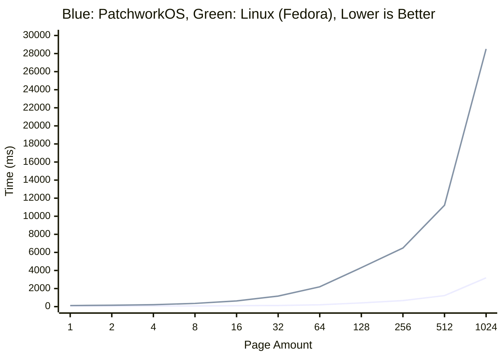

# PatchworkOS
<br>
<div align="center">
    <a href="LICENSE"></a>
    <a href="https://github.com/KaiNorberg/PatchworkOS/actions/workflows/test.yml"></a>
    <br>
    <i>PatchworkOS is currently in a very early stage of development, and may have both known and unknown bugs.</i>
</div>
<br>

**Patchwork** is a monolithic non-POSIX operating system for the x86_64 architecture that rigorously follows an "everything is a file" philosophy. Built from scratch in C it takes many ideas from Unix, Plan9 and others while simplifying them and adding in some new ideas of its own.

In the end this is a project made for fun, however the goal is still to make a feature-complete and experimental operating system which attempts to use unique algorithms and designs over tried and tested ones. Sometimes this leads to bad results, and sometimes, hopefully, good ones.

Additionally, the OS aims to, in spite of its experimental nature, remain approachable and educational, something that can work as a middle ground between fully educational operating systems like xv6 and production operating system like Linux.

<table>
<tr>
<td width="50%">

</td>
<td width="50%">

</td>
</tr>
</table>

## Features

### Kernel

- Multithreading with a [constant-time scheduler](https://github.com/KaiNorberg/PatchworkOS/blob/main/src/kernel/sched/sched.h), fully preemptive and tickless
- Symmetric Multi Processing
- Physical and virtual memory management is `O(1)` per page and `O(n)` where `n` is the number of pages per allocation/mapping operation, see [benchmarks](#benchmarks) for more info
- Dynamic kernel and user stack allocation
- File based IPC including [pipes](https://github.com/KaiNorberg/PatchworkOS/blob/main/src/kernel/ipc/pipe.h), [shared memory](https://github.com/KaiNorberg/PatchworkOS/blob/main/src/kernel/ipc/shmem.h), [sockets](https://github.com/KaiNorberg/PatchworkOS/blob/main/src/kernel/net) and Plan9 inspired "signals" called [notes](https://github.com/KaiNorberg/PatchworkOS/blob/main/src/kernel/ipc/note.h)
- File based device APIs, including [framebuffers](https://github.com/KaiNorberg/PatchworkOS/blob/main/src/kernel/helpers/fb.h), [keyboards](https://github.com/KaiNorberg/PatchworkOS/blob/main/src/kernel/helpers/kbd.h), [mice](https://github.com/KaiNorberg/PatchworkOS/blob/main/src/kernel/helpers/mouse.h) and more
- Synchronization primitives including mutexes, read-write locks and [futexes](https://github.com/KaiNorberg/PatchworkOS/blob/main/src/kernel/sync/futex.h)
- SIMD support

### ACPI

- From scratch and heavily documented [AML parser](https://github.com/KaiNorberg/PatchworkOS/blob/main/src/kernel/acpi/aml/aml.h)
- Tested on real hardware, see [Tested Configurations](#tested-configurations)
- ACPI implementation was made to be easy to understand and useful for educational purposes
- Tested against [ACPICA's](https://github.com/acpica/acpica) runtime test suite (WIP)
- ACPI support is still work in progress, check [acpi.h](https://github.com/KaiNorberg/PatchworkOS/blob/main/src/kernel/acpi/acpi.h) for a checklist

### File System

- Unix-style VFS with mountpoints, hardlinks, per-process namespaces, etc.
- Strict adherence to "everything is a file" philosophy
- Custom image format [(.fbmp)](https://github.com/KaiNorberg/fbmp)
- Custom font format [(.grf)](https://github.com/KaiNorberg/grf)

### User Space

- Custom C standard library and system libraries
- Highly modular shared memory based desktop environment
- Theming via [config files](https://github.com/KaiNorberg/PatchworkOS/blob/main/root/cfg)
- Note that currently a heavy focus has been placed on the kernel and low-level stuff, so user space is quite small... for now

*And much more...*

## Notable Differences with POSIX

- Replaced `fork(), exec()` with `spawn()`
- No "user" concept
- Non-POSIX standard library
- Even heavier focus on "everything is a file"
- File flags instead of file modes/permissions
- Custom [shell utilities](#shell-utilities)

## Limitations

- Currently limited to RAM disks only (Waiting for USB support)
- Only support for x86_64

## Notable Future Plans

- `share()`, `claim()` and `bind()` calls
- Read, write, execute flags
- Shell overhaul
- Capability style per-process permissions, as a replacement for per-user permissions, via namespace mountpoints with read/write/execute permissions
- Add configurability to `spawn()` for namespace inheritance

- Asynchronous I/O
- Modular kernel
- Shared libraries
- USB support (The holy grail)

---

## Doxygen Documentation

As one of the main goals of PatchworkOS is to be educational, I have tried to document the codebase as much as possible along with providing citations to any sources used. Currently, this is still a work in progress, but as old code is refactored and new code is added, I try to add documentation.

If you are interested in knowing more, then you can check out the Doxygen generated [documentation](https://kainorberg.github.io/PatchworkOS/html/index.html).

## Benchmarks

All benchmarks were run on real hardware using a Lenovo ThinkPad E495. For comparison, I've decided to use the Linux kernel, specifically Fedora since It's what I normally use.

Note that Fedora will obviously have a lot more background processes running and security features that might impact performance, so these benchmarks are not exactly apples to apples, but they should still give a good baseline for how PatchworkOS performs.

All code for benchmarks can be found in the [benchmark program](https://github.com/KaiNorberg/PatchworkOS/blob/main/src/programs/benchmark/benchmark.c), all tests were run using the optimization flag `-O3`.

### Memory Allocation/Mapping

The test maps and unmaps memory in varying page amounts for a set amount of iterations using generic mmap and munmap functions. Below is the results from PatchworkOS as of commit `cc69fab` and Fedora 40, kernel version `6.14.5-100.fc40.x86_64`.



We see that PatchworkOS performs better with a small number of pages, showing that each operation is more efficient, and that it performs better with a large number of pages, showing that the algorithmic complexity is better.

There are a few potential reasons for this, one is that PatchworkOS does not use a separate structure to manage virtual memory, instead it embeds metadata directly into the page tables, and since accessing a page table is just walking some pointers, its highly efficient, additionally it provides better caching since the page tables are likely already in the CPU cache.

In the end we end up with a `O(1)` complexity per page operation, or technically, since the algorithm for finding unmapped memory sections is `O(r)` in the worst case where `r` is the size of the address region to check in pages, having more memory allocated would potentially actually improve performance but only by a very small amount. We do of course get `O(n)` complexity per allocation/mapping operation where `n` is the number of pages.

Of course, there are limitations to this approach, for example, it is in no way portable (which isn't a concern in our case), each address space can only contain `2^7 - 1` unique shared memory regions, and copy-on-write would not be easy to implement (however, the need for this is reduced due to PatchworkOS using a `spawn()` instead of a `fork()`).

All in all, this algorithm would not be usable as a replacement for existing algorithms, but for PatchworkOS, it serves its purpose very efficiently.

[VMM Doxygen Documentation](https://kainorberg.github.io/PatchworkOS/html/dd/df0/group__kernel__mem__vmm.html)

[Paging Doxygen Documentation](https://kainorberg.github.io/PatchworkOS/html/df/d5f/group__common__paging.html)

## Shell Utilities

Patchwork includes its own shell utilities designed around its [file flags](#file-flags) system. Included is a brief overview with some usage examples. For convenience the init program will create hardlinks for each shell utility to their UNIX equivalents, this can be configured in the [init cfg](https://github.com/KaiNorberg/PatchworkOS/tree/main/root/cfg/init-main.cfg).

### `open`

Opens a file path and then immediately closes it. Intended as a replacement for `touch`.

```bash
# Create the file.txt file only if it does not exist.
open file.txt:create:excl

# Create the mydir directory.
open mydir:create:dir
```

### `read`

Reads from stdin or provided files and outputs to stdout. Intended as a replacement for `cat`.

```bash
# Read the contents of file1.txt and file2.txt.
read file1.txt file2.txt

# Read process status (blocks until process exits)
read /proc/1234/status

# Copy contents of file.txt to dest.txt and create it.
read < file.txt > dest.txt:create
```

### `write`

Writes to stdout. Intended as a replacement for `echo`.

```bash
# Write to file.txt.
write "..." > file.txt

# Append to file.txt, makes ">>" unneeded.
write "..." > file.txt:append
```

### `dir`

Reads the contents of a directory to stdout. Intended as a replacement for `ls`.

```bash
# Prints the contents of mydir.
dir mydir

# Recursively print the contents of mydir.
dir mydir:recur
```

### `delete`

Deletes a file or directory. Intended as a replacement for `rm`, `unlink` and `rmdir`.

```bash
# Delete file.txt.
delete file.txt

# Recursively delete mydir and its contents.
delete mydir:recur
```

There are other utils available that work as expected, for example `stat` and `link`.

## Everything is a File

Patchwork strictly follows the "everything is a file" philosophy in a way similar to Plan9, this can often result in unorthodox APIs or could just straight up seem overly complicated, but it has its advantages. We will use sockets to demonstrate the kinds of APIs this produces.

### Sockets

In order to create a local seqpacket socket, you open the `/net/local/seqpacket` file. The opened file will act as the handle for your socket. Reading from the handle will return the ID of your created socket so, for example, you can do

```c
fd_t handle = open("/net/local/seqpacket");
char id[32] = {0};
read(handle, id, 31);
close(handle);
```

Note that even when the handle is closed the socket will persist until the process that created it and all its children have exited. The ID that the handle returns is the name of a directory that has been created in the `/net/local` directory, in which are three files, these include:

- `data` - used to send and retrieve data
- `ctl` - used to send commands
- `accept` - used to accept incoming connections

So, for example, the sockets data file is located at `/net/local/[id]/data`.

Say we want to make our socket into a server, we would then use the bind and listen commands with the `ctl` file, we can then write

```c
fd_t ctl = openf("/net/local/%s/ctl", id);
writef(ctl, "bind myserver");
writef(ctl, "listen");
close(ctl);
```

Note the use of `openf()` which allows us to open files via a formatted path and that we name our server `myserver`. If we wanted to accept a connection using our newly created server, we just open its accept file by writing

```c
fd_t fd = openf("/net/local/%s/accept", id);
```

The returned file descriptor can be used to send and receive data, just like when calling `accept()` in for example Linux or other POSIX operating systems. Note that the entire socket API does attempt to mimic the POSIX socket API, apart from using these weird files everything (should) work as expected.

For the sake of completeness, if we wanted to connect to this server, we can do

```c
fd_t handle = open("/net/local/seqpacket");
char id[32] = {0};
read(handle, id, 32);
close(handle);

fd_t ctl = openf("/net/local/%s/ctl", id);
writef(ctl, "connect myserver");
close(ctl);
```

which would create a new socket and connect it to the server named `myserver`.

[Doxygen Documentation](https://kainorberg.github.io/PatchworkOS/html/d0/d22/group__kernel__net.html)

### Namespaces

Namespaces are a set of mountpoints that is unique per process with each process able to access the mountpoints in its parent's namespace, which allows each process a unique view of the file system and is utilized for access control.

Think of it like this, in the common case, for instance on Linux, you can mount a drive to `/mnt/mydrive` and all processes can then open the `/mnt/mydrive` path and see the contents of that drive. In PatchworkOS, this is also possible, but for security reasons we might not want every process to be able to see that drive, instead processes should see the original contents of `/mnt/mydrive` which might just be an empty directory. The exception is for the process that created the mountpoint and its children as they would have that mountpoint in their namespace.

For example, the "id" directories mentioned in the socket example are a separate "sysfs" instance mounted in the namespace of the creating process, meaning that only that process and its children can see their contents.

[Doxygen Documentation](https://kainorberg.github.io/PatchworkOS/html/d5/dbd/group__kernel__fs__namespace.html)

### Namespace Sharing

It's possible for two processes to voluntarily share a mountpoint in their namespaces using `bind()` in combination with two new system calls `share()` and `claim()`.

For example, if process A wants to share its `/net/local/5` directory from the socket example with process B, they can do

```c
// In process A
fd_t dir = open("/net/local/5:dir");
// Create a "key" for the file descriptor, this is a unique one time use randomly generated
// integer that can be used to retrieve the file descriptor in another process.
key_t key = share(dir);

// In process B
// The key is somehow communicated to B via IPC, for example a pipe, socket, argv, etc.
key_t key = ...;
// Use the key to open a file descriptor to the directory, this will invalidate the key.
fd_t dir = claim(key);
// Will error here if the original file descriptor in process A has been closed.
// Make "dir" ("/net/local/5" in A) available in B's namespace at "/any/path/it/wants"
// In practice it might be best to mount it to the same path as in A to avoid confusion.
bind(dir, "/any/path/it/wants");
```

This system guarantees consent between processes, and can be used to implement more complex access control systems.

An interesting detail is that when process A opens the `net/local/5` directory, the dentry underlying the file descriptor is the root of the mounted file system, if process B were to try to open this directory, it would still succeed as the directory itself is visible, however process B would instead retrieve the dentry of the directory in the parent superblock, and would instead see the content of that directory in the parent superblock. If this means nothing to you, don't worry about it.

[Doxygen Documentation](https://kainorberg.github.io/PatchworkOS/html/d5/dbd/group__kernel__fs__namespace.html)

### File Flags?

You may have noticed that in the above section sections, the `open()` function does not take in a flags argument. This is because flags are part of the file path directly so if you wanted to create a non-blocking socket, you can write

```c
fd_t handle = open("/net/local/seqpacket:nonblock");
```

Multiple flags are allowed, just separate them with the `:` character, this means flags can be easily appended to a path using the `openf()` function. It is also possible to just specify the first letter of a flag, so instead of `:nonblock` you can use `:n`. Note that duplicate flags are ignored and that there are no read or write flags, all files are both read and write.

[Doxygen Documentation](https://kainorberg.github.io/PatchworkOS/html/dd/de3/group__kernel__fs__path.html#ga82917c2c8f27ffa562957d5cfa4fdb2e)

---

## Directories

| Directory | Description |
|:----------|:------------|
| `include` | Public API |
| `src` | Source code |
| `root` | Files copied to the root directory of the generated .iso |
| `tools` | Build scripts (hacky alternative to cross-compiler) |
| `make` | Make files |
| `lib` | Third party dependencies |
| `meta` | Screenshots and repo metadata |

### Sections

- **boot**: Minimal UEFI bootloader that collects system info and loads the kernel
- **kernel**: The monolithic kernel handling everything from scheduling to IPC
- **libstd**: C standard library extension with system call wrappers
- **libpatchwork**: Higher-level library for windowing and user space services
- **programs**: Shell utilities, services, and desktop applications

## Setup

### Requirements

| Requirement | Details |
|:------------|:--------|
| **OS** | Linux (WSL might work, but I make no guarantees) |
| **Tools** | GCC, make, NASM, mtools, QEMU (optional) |

### Build and Run

```bash
# Clone this repository, you can also use the green Code button at the top of the Github.
git clone https://github.com/KaiNorberg/PatchworkOS
cd PatchworkOS

# Build (creates PatchworkOS.img in bin/)
make all

# Run using QEMU
make run
```

### Additional commands

```bash
# Clean build files
make clean

# Build with debug mode enabled
make all DEBUG=1

# Build with debug mode enabled and testing enabled (you will need to have iasl installed)
make all DEBUG=1 TESTING=1

# Debug using qemu with one cpu and GDB
make all run DEBUG=1 QEMU_CPUS=1 GDB=1

# Generate doxygen documentation
make doxygen

# Create compile commands file
make compile_commands
```

### Grub Loopback

For frequent testing, it might be inconvenient to frequently flash to a USB. You can instead set up the `.img` file as a loopback device in GRUB.

Add this entry to the `/etc/grub.d/40_custom` file:

```bash
menuentry "Patchwork OS" {
        set root="[The grub identifer for the drive. Can be retrived using: sudo grub2-probe --target=drive /boot]"
        loopback loop0 /PatchworkOS.img # Might need to be modified based on your setup.
        set root=(loop0)
        chainloader /efi/boot/bootx64.efi
}
```

Regenerate grub configuration using `sudo grub2-mkconfig -o /boot/grub2/grub.cfg`.

Finally copy the generated `.img` file to your `/boot` directory, this can also be done with `make grub_loopback`.

You should now see a new entry in your GRUB boot menu allowing you to boot into the OS, like dual booting, but without the need to create a partition.

### Troubleshooting

- **QEMU boot failure**: Check if you are using QEMU version 10.0.0, as that version has previously caused issues. These issues appear to be fixed currently however consider using version 9.2.3
- **Any other errors?**: If an error not listed here occurs or is not resolvable, please open an issue in the GitHub repository.

## Testing

Testing uses a GitHub action that compiles the project and runs it for some amount of time using QEMU both with the `DEBUG=1` and `TESTING=1` flags enabled. This will run some additional tests in the kernel (for example it will clone ACPICA and run all its runtime tests), and if it has not crashed by the end of the allotted time, it is considered a success.

### Tested Configurations

- QEMU emulator version 9.2.3 (qemu-9.2.3-1.fc42)
- Lenovo ThinkPad E495
- Ryzen 5 3600X | 32GB 3200MHZ Corsair Vengeance

Currently untested on Intel hardware. Let me know if you have different hardware, and it runs (or doesn't) for you!

## Contributing

Contributions are welcome! Anything from bug reports/fixes, performance improvements, new features, or even just fixing typos or adding documentation!

If you are unsure where to start, try searching for any "TODO" comments in the codebase.

Check out the [contribution guidelines](CONTRIBUTING.md) to get started.

## Nostalgia

[The first Reddit post and image of PatchworkOS](https://www.reddit.com/r/osdev/comments/18gbsng/a_little_over_2_years_ago_i_posted_a_screenshot/) from back when getting to user space was a huge milestone.
