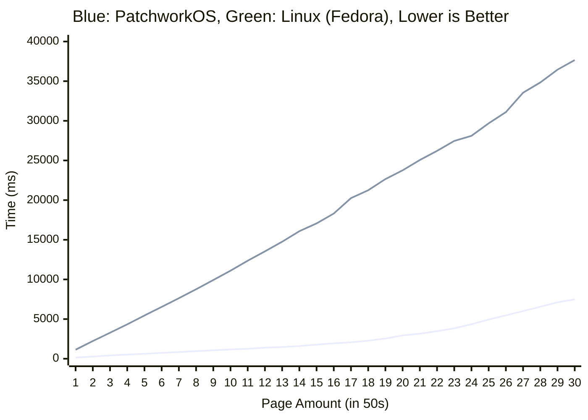

# PatchworkOS

<br>
<div align="center">
    <a href="https://github.com/KaiNorberg/PatchworkOS/issues">
      
    </a>
    <a href="https://github.com/KaiNorberg/PatchworkOS/network">
      
    </a>
    <a href="https://github.com/KaiNorberg/PatchworkOS/stargazers">
      
    </a>
    <a href="https://kainorberg.github.io/PatchworkOS/html/index.html">
      
    </a>
    <a href="https://github.com/KaiNorberg/PatchworkOS/blob/main/license">
      
    </a>
    <a href="https://github.com/KaiNorberg/PatchworkOS/actions/workflows/test.yml">
        
    </a>
    <br>
    <i>PatchworkOS is currently in a very early stage of development, and may have both known and unknown bugs.</i>
</div>
<br>


**PatchworkOS** is a modular non-POSIX operating system for the x86_64 architecture that rigorously follows an "everything is a file" philosophy, in the style of Plan9. Built from scratch in C and assembly, its intended to be an educational and experimental operating system.

In the end this is a project made for fun, but the goal is to make a "real" operating system, one that runs on real hardware and has the performance one would expect from a modern operating system without jumping ahead to user space features, a ACPI unaware floppy disk driver loaded into a pure monolithic kernel is not enough and neither is a round-robin array scheduler.

Also, this is not a UNIX clone, its intended to be a (hopefully) interesting experiment in operating system design by attempting to use unique algorithms and designs over tried and tested ones. Sometimes this leads to bad results, and sometimes, with a bit of luck, good ones.

Finally, despite its experimental nature and scale, the project aims to remain approachable and educational, something that can work as a middle ground between fully educational operating systems like xv6 and production operating system like Linux.

Will this project ever reach its goals? Probably not, but thats not the point.

<table>
<tr>
<td width="50%" valign="top" align="center">
  
  <br>
  <i>Stress test showing ~100% utilization across 12 CPUs.</i>
</td>
<td width="50%" valign="top" align="center">
  
  <br>
  <i>DOOM running on PatchworkOS using a <a href="https://github.com/ozkl/doomgeneric">doomgeneric</a> port.</i>
</td>
</tr>
</table>

## Features

### Kernel

- Fully preemptive and tickless [EEVDF scheduler](https://kainorberg.github.io/PatchworkOS/html/d7/d85/group__kernel__sched.html) based upon the [original paper](https://citeseerx.ist.psu.edu/document?repid=rep1&type=pdf&doi=805acf7726282721504c8f00575d91ebfd750564) and implemented using a [Augmented Red-Black tree](https://github.com/KaiNorberg/PatchworkOS/blob/main/include/kernel/utils/rbtree.h) to achieve `O(log n)` worst case complexity. EEVDF is the same algorithm used in the modern Linux kernel, but ours is obviously **a lot** less mature.
- Multithreading and Symmetric Multi Processing with fine-grained locking.
- Physical and virtual memory management is `O(1)` per page and `O(n)` where `n` is the number of pages per allocation/mapping operation, see [benchmarks](#benchmarks) for more info.
- File based IPC including [pipes](https://github.com/KaiNorberg/PatchworkOS/blob/main/include/kernel/ipc/pipe.h), [shared memory](https://github.com/KaiNorberg/PatchworkOS/blob/main/include/kernel/ipc/shmem.h), [sockets](https://github.com/KaiNorberg/PatchworkOS/blob/main/include/kernel/net) and Plan9 inspired "signals" called [notes](https://github.com/KaiNorberg/PatchworkOS/blob/main/include/kernel/ipc/note.h).
- File based device APIs, including [framebuffers](https://github.com/KaiNorberg/PatchworkOS/blob/main/include/kernel/helpers/fb.h), [keyboards](https://github.com/KaiNorberg/PatchworkOS/blob/main/include/kernel/helpers/kbd.h), [mice](https://github.com/KaiNorberg/PatchworkOS/blob/main/include/kernel/helpers/mouse.h) and more.
- [Synchronization primitives](https://github.com/KaiNorberg/PatchworkOS/blob/main/include/kernel/sync) including mutexes, read-write locks, sequential locks, futexes and others.
- Highly [Modular design](#modules), even [SMP Bootstrapping](https://github.com/KaiNorberg/PatchworkOS/blob/main/src/modules/smp/smp.c) is done in a module.

### File System

- Unix-style VFS with mountpoints, hardlinks, per-process namespaces, etc.
- Custom [Framebuffer BitMaP](https://github.com/KaiNorberg/fbmp) (.fbmp) image format, allows for faster loading by removing the need for parsing.
- Custom [Grayscale Raster Font](https://github.com/KaiNorberg/grf) (.grf) font format, allows for antialiasing and kerning without complex vector graphics.

### User Space

- Custom C standard library and system libraries.
- Highly modular shared memory based desktop environment.
- Theming via [config files](https://github.com/KaiNorberg/PatchworkOS/blob/main/root/cfg).
- Note that currently a heavy focus has been placed on the kernel and low-level stuff, so user space is quite small... for now.

*And much more...*

## Notable Differences with POSIX

- Replaced `fork(), exec()` with `spawn()`.
- No "user" concept.
- Non-POSIX standard library.
- Even heavier focus on "everything is a file".
- File flags instead of file modes/permissions.

## Limitations

- Currently limited to RAM disks only (Waiting for USB support).
- Only support for x86_64.

## Notable Future Plans

- Read, write, execute, create permissions.
- Capability style per-process permissions, as a replacement for per-user permissions, via namespace mountpoints with read/write/execute permissions.
- Fully Asynchronous I/O and syscalls (io_uring?).
- USB support (The holy grail).

---

## Doxygen Documentation

As one of the main goals of PatchworkOS is to be educational, I have tried to document the codebase as much as possible along with providing citations to any sources used. Currently, this is still a work in progress, but as old code is refactored and new code is added, I try to add documentation.

If you are interested in knowing more, then you can check out the Doxygen generated [documentation](https://kainorberg.github.io/PatchworkOS/html/index.html). For an overview check the `topics` section in the sidebar.

## Modules

PatchworkOS uses a "modular" kernel design, meaning that instead of having one big kernel binary, the kernel is split into several smaller "modules" that can be loaded and unloaded at runtime. In effect, the kernel can rewrite itself by adding and removing functionality as needed.

This is highly convenient for development but it also has practical advantages, for example, there is no need to load a driver for a device that is not attached to the system, saving memory.

### Make your own Module

The process of making a module is intended to be as straightforward as possible. For the sake of demonstration, we will create a simple "Hello, World!" module.

First, we create a new directory in `src/kernel/modules/` named `hello`, and inside that directory we create a `hello.c` file to which we write the following code:

```c
#include <kernel/module/module.h>
#include <kernel/log/log.h>

#include <stdint.h>

uint64_t _module_procedure(const module_event_t* event)
{
    switch (event->type)
    {
    case MODULE_EVENT_LOAD:
        LOG_INFO("Hello, World!\n");
        break;
    default:
        break;
    }

    return 0;
}

MODULE_INFO("Hello", "<author>", "A simple hello world module", "1.0", "MIT", "BOOT_ALWAYS");
```

An explanation of the code will be provided later.

Now we need to add the module to the build system. To do this, just copy a existing module's `.mk` file without making any modifications. For example, we can copy `src/modules/drivers/ps2/ps2.mk` to `src/modules/hello/hello.mk`. The build system will handle the rest, including copying the module to the final image.

Now, we can build and run PatchworkOS using `make all run`, or we could use `make all` and then flash the generated `bin/PatchworkOS.img` file to a USB drive.

Now to validate that the module is working, you can either watch the boot log and spot the `Hello, World!` message, or you could use `grep` on the `/dev/klog` file in the terminal program like so:

```bash
cat /dev/klog | grep "Hello, World!"
```

This should output something like:

```bash
[   0.747-00-I] Hello, World!
```

Thats all, if this did not work, make sure you followed all the steps correctly, if there is still issues, feel free to open an issue.

### What can I do now?

Whatever you want. You can include any kernel header, or even headers from other modules, create your own modules and include their headers or anything else. There is no need to worry about linking, dependencies or exporting/importing symbols, the kernels module loader will handle all of it for you. Go nuts.

### Code Explanation

This code in the `hello.c` file does a few things. First, it includes the relevant kernel headers.

Second, it defines a `_module_procedure()` function. This function serves as the entry point for the module and will be called by the kernel to notify the module of events, for example the module being loaded or a device attached. On the load event, it will print using the kernels logging system `"Hello, World!"`, resulting in the message being readable from `/dev/klog`.

Finally, it defines the modules information. This information is, in order, the name of the module, the author of the module (thats you), a short description of the module, the module version, the licence of the module, and finally a list of "device types", in this case just `BOOT_ALWAYS`, but more could be added by separating them with a semicolon (`;`).

The list of device types is what causes the kernel to actually load the module. I will avoid going into to much detail (you can check the documentation for that), but I will explain it briefly.

The module loader itself has no idea what these type strings actually are, but subsytems within the kernel can specify that "a device of the type represented by this string is now available", the module loader can then load either one or all modules that have specified in their list of device types that it can handle the specified type. This means that any new subsystem, ACPI, USB, PCI, etc, can implement dynamic module loading using whatever types they want.

So what is `BOOT_ALWAYS`? It is the type of a special device that the kernel will pretend to "attach" during boot. In this case, it simply causes our hello module to be loaded during boot.

For more information, check the [Module Doxygen Documentation](https://kainorberg.github.io/PatchworkOS/html/dd/d41/group__kernel__module.html).

## ACPI (WIP)

PatchworkOS features a from-scratch ACPI implementation and AML parser, with the goal of being, atleast by ACPI standards, easy to understand and educational. It is tested on the [Tested Configurations](#tested-configurations) below and against [ACPICA's](https://github.com/acpica/acpica) runtime test suite, but remains a work in progress (and probably always will be).

See [ACPI Doxygen Documentation](https://kainorberg.github.io/PatchworkOS/html/d0/d30/group__kernel__acpi.html) for a progress checklist.

See [ACPI specification Version 6.6](https://uefi.org/specs/ACPI/6.6/index.html) as the main reference.

### What is ACPI?

ACPI or Advanced Configuration and Power Interface is used for *alot* of things in modern systems but mainly power management and device enumeration/configuration. Its not possible to go over everything here, instead a brief overview of the parts most likely to cause confusion while reading the code will be provided.

It consists of two main parts, the ACPI tables and AML bytecode. If you have completed a basic operating systems tutorial, you have probably seen the ACPI tables before, for example the RSDP, FADT, MADT, etc. These tables are static in memory data structures storing information about the system, they are very easy to parse but are limited in what they can express.

AML or ACPI Machine Language is a turning complete "mini language", and the source of mutch frustration, that is used to express more complex data, primarily device configuration. This is needed as its impossible for any specification to account for every possible hardware configuration that exists currently, much less that may exist in the future. So instead of trying to design that, what if we could just had a small program generate whatever data we wanted dynamically? Well thats more or less what AML is.

### Device Configuration

To demonstrate how ACPI is used for device configuration, we will use the [PS/2 driver](https://github.com/KaiNorberg/PatchworkOS/tree/main/src/modules/drivers/ps2) as an example.

If you have followed a basic operating systems tutorial, you have probably implemented a PS/2 keyboard driver at some point, and most likely you hardcoded the I/O ports `0x60` and `0x64` for data and commands respectively, and IRQ `1` for keyboard interrupts.

Using this hardcoded approach will work for the vast majority of systems, but, perhaps surprisingly, there is no standard that guarantees that these ports and IRQs will actually be used for PS/2 devices. Its just a silent agreement that pretty much all systems adhere to for legacy reasons.

But this is where the device configuration from AML comes in, it lets us query the system for the actual resources used by the PS/2 keyboard, so we dont have to rely on hardcoded values.

If you where to decompile the AML bytecode into its original ASL (ACPI Source Language), you might find something like this:

```asl
Device (KBD)
{
    Name (_HID, EisaId ("PNP0303") /* IBM Enhanced Keyboard (101/102-key, PS/2 Mouse) */)  // _HID: Hardware ID
    Name (_STA, 0x0F)  // _STA: Status
    Name (_CRS, ResourceTemplate ()  // _CRS: Current Resource Settings
    {
        IO (Decode16,
            0x0060,             // Range Minimum
            0x0060,             // Range Maximum
            0x01,               // Alignment
            0x01,               // Length
            )
        IO (Decode16,
            0x0064,             // Range Minimum
            0x0064,             // Range Maximum
            0x01,               // Alignment
            0x01,               // Length
            )
        IRQNoFlags ()
            {1}
    })
}
```

*Note that just like C compiles to assembly, ASL compiles to AML bytecode, which is what the OS actually parses.*

In the example ASL, we se a `Device` object representing a PS/2 keyboard. It has a hardware ID (`_HID`), which we can cross reference with a [online database](https://uefi.org/PNP_ACPI_Registry) to confirm that it is indeed a PS/2 keyboard, a status (`_STA`), which is just a bitfield indicating if the device is present, enabled, etc, and finally the current resource settings (`_CRS`), which is the thing we are really after.

The `_CRS` might look a bit complicated but focus on the `IO` and `IRQNoFlags` entries. Notice how they are specifying the I/O ports and IRQ used by the keyboard? Which in this case are indeed `0x60`, `0x64` and `1` respectively. So in this case the standard held true.

So how is this information used? Durring boot, the `_CRS` information of each device is parsed by the ACPI subsystem, it then queries the kernel for the needed resources, assigned them to each device and makes the final configuration available to drivers.

Then when the PS/2 driver is loaded, it gets told "you are handling a device with the name `\_SB_.PCI0.SF8_.KBD_` (which is just the full path to the device object in the ACPI namespace) and the type `PNP0303`", it can then query the ACPI subsystem for the resources assigned to that device, and use them instead of hardcoded values.

Having access to this information for all devices also allows us to avoid resource conflicts, making sure two devices are not trying to use the same IRQ(s) or I/O port(s).

Of course, it gets way, way worse than this, but hopefully this clarifies why the PS/2 driver and other drivers, might look a bit different than what you might be used to.

## Everything is a File

PatchworkOS strictly follows the "everything is a file" philosophy in a way similar to Plan9, this can often result in unorthodox APIs or could just straight up seem overly complicated, but it has its advantages. We will use sockets to demonstrate the kinds of APIs this produces.

### Sockets

In order to create a local seqpacket socket, you open the `/net/local/seqpacket` file. The opened file will act as the handle for your socket. Reading from the handle will return the ID of your created socket so, for example, you can do

```c
char id[32] = {0};
readfile("/net/local/seqpacket", id, 31, 0); // Helper function that opens, reads and closes a file.
```

Note that even when the handle is closed the socket will persist until the process that created it and all its children have exited. The ID that the handle returns is the name of a directory that has been created in the `/net/local` directory, in which are three files, these include:

- `data` - used to send and retrieve data
- `ctl` - used to send commands
- `accept` - used to accept incoming connections

So, for example, the sockets data file is located at `/net/local/[id]/data`.

Say we want to make our socket into a server, we would then use the bind and listen commands with the `ctl` file, we can then write

```c
fd_t ctl = openf("/net/local/%s/ctl", id);
writef(ctl, "bind myserver");
writef(ctl, "listen");
close(ctl);
```

Note the use of `openf()` which allows us to open files via a formatted path and that we name our server `myserver`. If we wanted to accept a connection using our newly created server, we just open its accept file by writing

```c
fd_t fd = openf("/net/local/%s/accept", id);
```

The returned file descriptor can be used to send and receive data, just like when calling `accept()` in for example Linux or other POSIX operating systems. Note that the entire socket API does attempt to mimic the POSIX socket API, apart from using these weird files everything (should) work as expected.

For the sake of completeness, if we wanted to connect to this server, we can do

```c
char id[32] = {0};
readfile("/net/local/seqpacket", id, 31, 0);

fd_t ctl = openf("/net/local/%s/ctl", id);
writef(ctl, "connect myserver");
close(ctl);
```

which would create a new socket and connect it to the server named `myserver`.

[Doxygen Documentation](https://kainorberg.github.io/PatchworkOS/html/df/d65/group__module__net.html)

### Namespaces

Namespaces are a set of mountpoints that is unique per process, which allows each process a unique view of the file system and is utilized for access control.

Think of it like this, in the common case, you can mount a drive to `/mnt/mydrive` and all processes can then open the `/mnt/mydrive` path and see the contents of that drive. However, for security reasons we might not want every process to be able to see that drive, this is what namespaces enable, allowing mounted file systems or directories to only be visible to a subset of processes.

As an example, the "id" directories mentioned in the socket example are a separate "sysfs" instance mounted in the namespace of the creating process, meaning that only that process and its children can see their contents.

To control which processes can see a newly mounted or bound file system or directory, we use a propegation system, where a the newly created mountpoint can be made visible to either just the creating process, the creating process and its children, or the creating process, its children and its parents. Additionally, its possible to specify the behaviour of mountpoint inheritance when a new process is spawned.

[Doxygen Documentation](https://kainorberg.github.io/PatchworkOS/html/d5/dbd/group__kernel__fs__namespace.html)

### Namespace Sharing

In cases where the propagation system is not sufficient, it's possible for two processes to voluntarily share a mountpoint in their namespaces using `bind()` in combination with two new system calls `share()` and `claim()`.

For example, if process A wants to share its `/net/local/5` directory from the socket example with process B, they can do

```c
// In process A
fd_t dir = open("/net/local/5:dir");

// Create a "key" for the file descriptor, this is a unique one time use randomly generated token that can be used to retrieve the file descriptor in another process.
key_t key;
share(&key, dir, CLOCKS_PER_SEC * 60); // Key valid for 60 seconds (CLOCKS_NEVER is also allowed)

// In process B
// The key is somehow communicated to B via IPC, for example a pipe, socket, argv, etc.
key_t key = ...;

// Use the key to open a file descriptor to the directory, this will invalidate the key.
fd_t dir = claim(key);
// Will error here if the original file descriptor in process A has been closed, process A exited, or the key expired.

// Make "dir" ("/net/local/5" in A) available in B's namespace at "/any/path/it/wants". In practice it might be best to bind it to the same path as in A to avoid confusion.
bind(dir, "/any/path/it/wants");

// Its also possible to just open paths in the shared directory without polluting the namespace using openat().
fd_t somePath = openat(dir, "data");
```

This system guarantees consent between processes, and can be used to implement more complex access control systems.

An interesting detail is that when process A opens the `net/local/5` directory, the dentry underlying the file descriptor is the root of the mounted file system, if process B were to try to open this directory, it would still succeed as the directory itself is visible, however process B would instead retrieve the dentry of the directory in the parent superblock, and would instead see the content of that directory in the parent superblock. If this means nothing to you, don't worry about it.

[Doxygen Documentation](https://kainorberg.github.io/PatchworkOS/html/d5/dbd/group__kernel__fs__namespace.html)

### File Flags?

You may have noticed that in the above section sections, the `open()` function does not take in a flags argument. This is because flags are part of the file path directly so if you wanted to create a non-blocking socket, you can write

```c
fd_t handle = open("/net/local/seqpacket:nonblock");
```

Multiple flags are allowed, just separate them with the `:` character, this means flags can be easily appended to a path using the `openf()` function. It is also possible to just specify the first letter of a flag, so instead of `:nonblock` you can use `:n`.

[Doxygen Documentation](https://kainorberg.github.io/PatchworkOS/html/dd/de3/group__kernel__fs__path.html#ga82917c2c8f27ffa562957d5cfa4fdb2e)

### But why?

Im sure you have heard many an argument for and against the "everything is a file" philosophy. So I wont go over everything, but the primary reason for using it in PatchworkOS is "emergent behavior" or "composability" which ever term you prefer.

Take the namespace sharing example, notice how there isent any actually dedicated "namespace sharing" system? There are instead a series of small, simple building blocks that when added together form a more complex whole. That is emergent behavior, by keeping things simple and most importantly composable, we can create very complex behaviour without needing to explicitly design it.

Lets take another example, say you wanted to wait on multiple processes with a `waitpid()` syscall. Well, thats not possible. So now we suddenly need a new system call. Meanwhile, in a "everything is a file system" we just have a pollable `/proc/[pid]/wait` file that blocks untill the process dies and returns the exit status, now any behaviour that can be implemented with `poll()` can be used while waiting on processes, including waiting on multiple processes at once, waiting on a keyboard and a process, waiting with a timeout, or any weird combination you can think of.

Plus its fun.

## Benchmarks

All benchmarks were run on real hardware using a Lenovo ThinkPad E495. For comparison, I've decided to use the Linux kernel, specifically Fedora since It's what I normally use.

Note that Fedora will obviously have a lot more background processes running and security features that might impact performance, so these benchmarks are not exactly apples to apples, but they should still give a good baseline for how PatchworkOS performs.

All code for benchmarks can be found in the [benchmark program](https://github.com/KaiNorberg/PatchworkOS/blob/main/src/programs/benchmark/benchmark.c), all tests were run using the optimization flag `-O3`.

### Memory Allocation/Mapping

The test maps and unmaps memory in varying page amounts for a set amount of iterations using generic mmap and munmap functions. Below is the results from PatchworkOS as of commit `4b00a88` and Fedora 40, kernel version `6.14.5-100.fc40.x86_64`.



We see that PatchworkOS performs better across the board, and the performance difference increases as we increase the page count.

There are a few potential reasons for this, one is that PatchworkOS does not use a separate structure to manage virtual memory, instead it embeds metadata directly into the page tables, and since accessing a page table is just walking some pointers, its highly efficient, additionally it provides better caching since the page tables are likely already in the CPU cache.

In the end we end up with a $O(1)$ complexity per page operation, or technically, since the algorithm for finding unmapped memory sections is $O(r)$ in the worst case where $r$ is the size of the address region to check in pages, having more memory allocated would potentially actually improve performance but only by a very small amount. We do of course get $O(n)$ complexity per allocation/mapping operation where $n$ is the number of pages.

Note that as the number of pages increases we start to see less and less linear performance, this is most likely due to CPU cache saturation.

For fun, we can throw the results into desmos to se that around $800$ to $900$ pages there is a "knee" in the curve. Saying that $x$ is the number of pages per iteration and $y$ is the time in milliseconds let us split the data into two sets. We can now perform linear regression which gives us

```math
y =
\begin{cases}
2.25874x+53.95918 & \text{if } x \leq 850, \quad R^2=0.9987,\\
8.68659x-5762.6044 & \text{if } x > 850, \quad R^2=0.9904.
\end{cases}
```

<br>

Performing quadratic regression on the same data gives us

```math
y =
\begin{cases}
0.000237618x^{2}+2.06855x+77.77119 & \text{if } x \leq 850, \quad R^2=0.9979,\\
0.00626813x^{2}-6.04352x+2636.69231 & \text{if } x > 850, \quad R^2=0.9973.
\end{cases}
```

<br>

From this we see that for $x \le 850$ the linear regression has a slightly better fit while for $x > 850$ the quadratic regression has a slightly better fit, this is most likely due to the CPU or TLB caches starting to get saturated. All in all this did not tell us much more than we already knew, so it was kinda pointless, but perhaps it is interesting to someone.

Of course, there are limitations to this approach, for example, it is in no way portable (which isn't a concern in our case), each address space can only contain $2^8 - 1$ unique shared memory regions, and copy-on-write would not be easy to implement (however, the need for this is reduced due to PatchworkOS using a `spawn()` instead of a `fork()`).

All in all, this algorithm would not be a viable replacement for existing algorithms, but for PatchworkOS, it serves its purpose very efficiently.

[VMM Doxygen Documentation](https://kainorberg.github.io/PatchworkOS/html/dd/df0/group__kernel__mem__vmm.html)

[Paging Doxygen Documentation](https://kainorberg.github.io/PatchworkOS/html/dc/d2c/group__kernel__mem__paging.html)

## Shell Utilities

PatchworkOS includes its own shell utilities designed around its [file flags](#file-flags) system. Included is a brief overview with some usage examples. For convenience the shell utilities are named after their POSIX counterparts, however they are not drop-in replacements.

### `touch`

Opens a file path and then immediately closes it.

```bash
# Create the file.txt file only if it does not exist.
touch file.txt:create:excl

# Create the mydir directory.
touch mydir:create:dir
```

### `cat`

Reads from stdin or provided files and outputs to stdout.

```bash
# Read the contents of file1.txt and file2.txt.
cat file1.txt file2.txt

# Read process exit status (blocks until process exits)
cat /proc/1234/wait

# Copy contents of file.txt to dest.txt and create it.
cat < file.txt > dest.txt:create
```

### `echo`

Writes to stdout.

```bash
# Write to file.txt.
echo "..." > file.txt

# Append to file.txt, makes ">>" unneeded.
echo "..." > file.txt:append
```

### `ls`

Reads the contents of a directory to stdout.

```bash
# Prints the contents of mydir.
ls mydir

# Recursively print the contents of mydir.
ls mydir:recur
```

### `rm`

Removes a file or directory.

```bash
# Remove file.txt.
rm file.txt

# Recursively remove mydir and its contents.
rm mydir:dir:recur
```

There are other utils available that work as expected, for example `stat` and `link`.

---

## Setup

### Requirements

| Requirement | Details |
|:------------|:--------|
| **OS** | Linux (WSL might work, but I make no guarantees) |
| **Tools** | GCC, make, NASM, mtools, QEMU (optional) |

### Build and Run

```bash
# Clone this repository, you can also use the green Code button at the top of the Github.
git clone https://github.com/KaiNorberg/PatchworkOS
cd PatchworkOS

# Build (creates PatchworkOS.img in bin/)
make all

# Run using QEMU
make run
```

### Additional commands

```bash
# Clean build files
make clean

# Build with debug mode enabled
make all DEBUG=1

# Build with debug mode enabled and testing enabled (you will need to have iasl installed)
make all DEBUG=1 TESTING=1

# Debug using qemu with one cpu and GDB
make all run DEBUG=1 QEMU_CPUS=1 GDB=1

# Debug using qemu and exit on panic
make all run DEBUG=1 QEMU_EXIT_ON_PANIC=1

# Generate doxygen documentation
make doxygen

# Create compile commands file
make compile_commands
```

### Repo Structure

Source code can be found in the `src/` directory, with public API headers in the `include/` directory, private API headers are located alongside their respective source files.

```plain
.
├── meta              // Meta files including screenshots, doxygen, etc.
├── lib               // Third party files, for example doomgeneric.
├── root              // Files to copy to the root of the generated image.
└── <src|include>     // Source code and public API headers.
    ├── kernel        // The kernel and its core subsystems.
    ├── modules       // Kernel modules, drivers, filesystems, etc.
    ├── programs      // User space programs.
    ├── libstd        // The C standard library.
    └── libpatchwork  // The PatchworkOS system library, gui, etc.
```

### Grub Loopback

For frequent testing, it might be inconvenient to frequently flash to a USB. You can instead set up the `.img` file as a loopback device in GRUB.

Add this entry to the `/etc/grub.d/40_custom` file:

```bash
menuentry "Patchwork OS" {
        set root="[The grub identifer for the drive. Can be retrived using: sudo grub2-probe --target=drive /boot]"
        loopback loop0 /PatchworkOS.img # Might need to be modified based on your setup.
        set root=(loop0)
        chainloader /efi/boot/bootx64.efi
}
```

Regenerate grub configuration using `sudo grub2-mkconfig -o /boot/grub2/grub.cfg`.

Finally copy the generated `.img` file to your `/boot` directory, this can also be done with `make grub_loopback`.

You should now see a new entry in your GRUB boot menu allowing you to boot into the OS, like dual booting, but without the need to create a partition.

### Troubleshooting

- **QEMU boot failure**: Check if you are using QEMU version 10.0.0, as that version has previously caused issues. These issues appear to be fixed currently however consider using version 9.2.3
- **Any other errors?**: If an error not listed here occurs or is not resolvable, please open an issue in the GitHub repository.

## Testing

Testing uses a GitHub action that compiles the project and runs it for some amount of time using QEMU with `DEBUG=1`, `TESTING=1` and `QEMU_EXIT_ON_PANIC=1` set. This will run some additional tests in the kernel (for example it will clone ACPICA and run all its runtime tests), and if QEMU has not crashed by the end of the allotted time, it is considered a success.

Note that the `QEMU_EXIT_ON_PANIC` flag will cause any failed test, assert or panic in the kernel to exit QEMU using their "-device isa-debug-exit" feature with a non-zero exit code, thus causing the GitHub action to fail.

### Tested Configurations

- QEMU emulator version 9.2.3 (qemu-9.2.3-1.fc42)
- Lenovo ThinkPad E495
- Ryzen 5 3600X | 32GB 3200MHZ Corsair Vengeance

Currently untested on Intel hardware (broke student, no access to hardware). Let me know if you have different hardware, and it runs (or doesn't) for you!

## Contributing

Contributions are welcome! Anything from bug reports/fixes, performance improvements, new features, or even just fixing typos or adding documentation.

If you are unsure where to start, try searching for any "TODO" comments in the codebase.

Check out the [contribution guidelines](CONTRIBUTING.md) to get started.

## Nostalgia

[The first Reddit post and image of PatchworkOS](https://www.reddit.com/r/osdev/comments/18gbsng/a_little_over_2_years_ago_i_posted_a_screenshot/) from back when getting to user space was a massive milestone and the kernel was supposed to be a UNIX-like microkernel.
