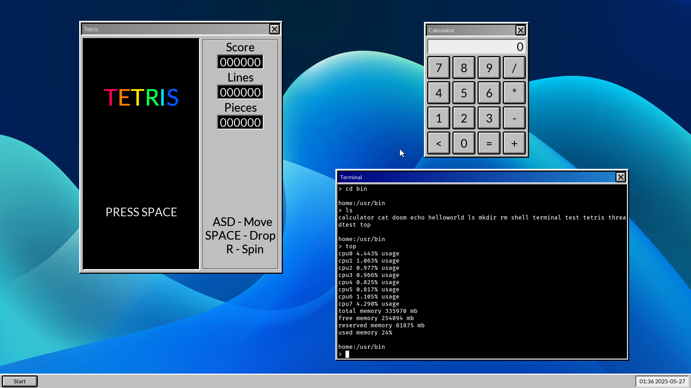
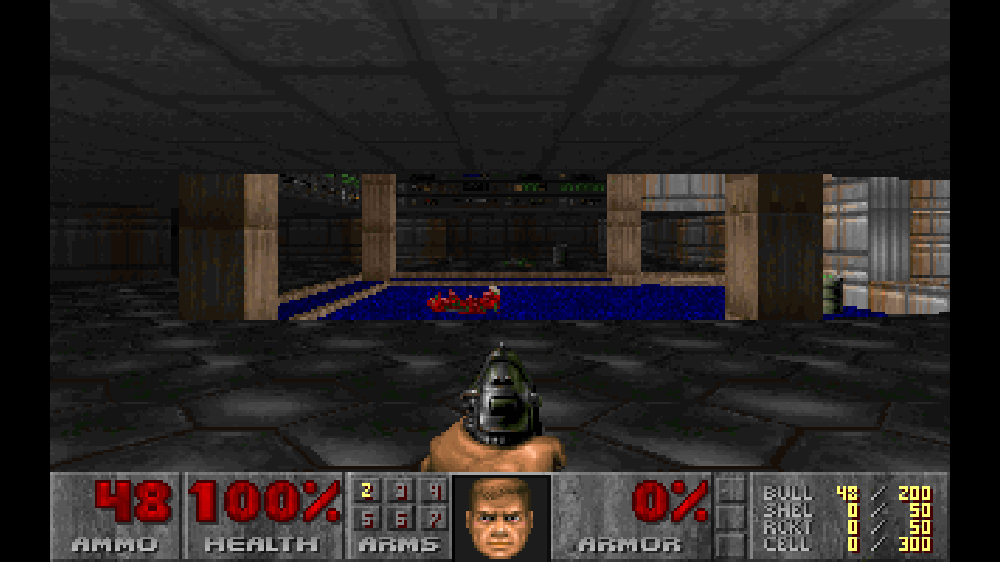

# PatchworkOS

> **⚠ Warning**<br>
> Keep in mind that PatchworkOS is currently in a very early stage of development, and may have both known and unknown bugs.

 [](https://github.com/KaiNorberg/PatchworkOS/actions/workflows/test.yml)

**Patchwork** is a monolithic non-POSIX operating system for the x86_64 architecture that rigorously follows a "everything is a file" philosophy. Built from scratch in C it takes many ideas from Unix, Plan9, DOS and others while simplifying them and sprinkling in some new ideas of its own.

The goal is to eventually have a feature-complete and unique operating system avoiding easy shortcuts while still remaining approachable and educational.




## Features

### Kernel

- Multithreading with a [constant-time scheduler](https://github.com/KaiNorberg/PatchworkOS/blob/main/src/kernel/sched/sched.h), fully preemptive and tickless
- Symmetric Multi Processing
- Constant-time memory management for both physical and virtual memory
- File based IPC including [pipes](https://github.com/KaiNorberg/PatchworkOS/blob/main/src/kernel/ipc/pipe.h), [shared memory](https://github.com/KaiNorberg/PatchworkOS/blob/main/src/kernel/ipc/shmem.h), [sockets](https://github.com/KaiNorberg/PatchworkOS/blob/main/src/kernel/net) and Plan9 inspired "signals" called [notes](https://github.com/KaiNorberg/PatchworkOS/blob/main/src/kernel/ipc/note.h)
- Synchronization primitives including mutexes, read-write locks and [futexes](https://github.com/KaiNorberg/PatchworkOS/blob/main/src/kernel/sync/futex.h)
- SIMD support

### ACPI

- From scratch and heavily documented [AML parser](https://github.com/KaiNorberg/PatchworkOS/blob/main/src/kernel/acpi/aml/aml.h)
- Tested on real hardware, see [Tested Configurations](#tested-configurations)
- ACPI implementation was made to be easy to understand and useful for educational purposes
- Tested against [ACPICA's](https://github.com/acpica/acpica) runtime test suite (WIP)
- ACPI support is still work in progress check [acpi.h](https://github.com/KaiNorberg/PatchworkOS/blob/main/src/kernel/acpi/acpi.h) for a checklist

### File System

- Linux-style VFS with dentry+inode caching, negative dentrys, mountpoints, hardlinks, etc.
- Strict adherence to "everything is a file" philosophy
- Custom image format [(.fbmp)](https://github.com/KaiNorberg/fbmp)
- Custom font format [(.grf)](https://github.com/KaiNorberg/grf)

### User Space

- Custom C standard library and system libraries
- Highly modular shared memory based desktop environment
- Theming via [config files](https://github.com/KaiNorberg/PatchworkOS/blob/main/root/cfg)

*And much more...*

---

## Notable Differences with Unix

- Replaced `fork(), exec()` with `spawn()`
- Single-User
- Non POSIX standard library
- Custom [shell utilities](#shell-utilities)

## Limitations

- Currently limited to RAM disks only
- Only support for x86_64

## Notable Future Plans

- Modular kernel
- Shared libraries
- Software interrupts for notes (signals)
- Lua port
- Capability based security model (currently has no well-defined security model)
- Visual overhaul of the desktop environment (modernize it?)
- USB support (The holy grail)

---

## Shell Utilities

Patchwork includes its own shell utilities designed around its [file flags](#file-flags) system. Included is a brief overview with some usage examples. For convenience the init program will create hardlinks for each shell utility to their unix equivalents, this can be configured in the [init cfg](https://github.com/KaiNorberg/PatchworkOS/tree/main/root/cfg/init-main.cfg).

### `open`

Opens a file path and then immediately closes it. Intended as a replacement for `touch`.

```bash
# Create the file.txt file only if it does not exist.
open file.txt:create:excl

# Create the mydir directory.
open mydir:create:dir
```

### `read`

Reads from stdin or provided files and outputs to stdout. Intended as a replacement for `cat`.

```bash
# Read the contents of file1.txt and file2.txt.
read file1.txt file2.txt

# Read process status (blocks until process exits)
read /proc/1234/status

# Copy contents of file.txt to dest.txt and create it.
read < file.txt > dest.txt:create
```

### `write`

Writes to stdout. Intended as a replacement for `echo`.

```bash
# Write to file.txt.
write "..." > file.txt

# Append to file.txt, makes ">>" unneeded.
write "..." > file.txt:append
```

### `dir`

Reads the contents of a directory to stdout. Intended as a replacement for `ls`.

```bash
# Prints the contents of mydir.
dir mydir

# Recursively print the contents of mydir.
dir mydir:recur
```

### `delete`

Deletes a file or directory. Intended as a replacement for `rm`, `unlink` and `rmdir`.

```bash
# Delete file.txt.
delete file.txt

# Recursively delete mydir and its contents.
delete mydir:recur
```

There are also other utils available that work as expected, for example `stat` and `link`.

## Everything is a File

Patchwork strictly follows the "everything is a file" philosophy in a way similar to Plan9, this can often result in unorthodox APIs or could just straight up seem overly complicated, but it has its advantages. I will give some examples and then after I will explain why this is not a complete waste of time. Let's start with sockets.

### Sockets

In order to create a local seqpacket socket, you open the `/net/local/seqpacket` file. The opened file will act as the handle for your socket. Reading from the handle will return the ID of your created socket so, for example, you can do

```c
fd_t handle = open("/net/local/seqpacket");
char id[32] = {0};
read(handle, id, 31);
```

Note that when the handle is closed, the socket is also freed. The ID that the handle returns is also the name of a directory that has been created in the `/net/local` directory, in which are three files, these include:

- `data` - used to send and retrieve data
- `ctl` - used to send commands
- `accept` - used to accept incoming connections

So, for example, the sockets data file is located at `/net/local/[id]/data`. Note that only the process that created the socket or its children can open these files.

Say we want to make our socket into a server, we would then use the bind and listen commands with the `ctl` file, we can then write

```c
fd_t ctl = openf("/net/local/%s/ctl", id);
writef(ctl, "bind myserver");
writef(ctl, "listen");
close(ctl);
```

Note the use of `openf()` which allows us to open files via a formatted path and that we name our server `myserver`. If we wanted to accept a connection using our newly created server, we just open its accept file by writing

```c
fd_t fd = openf("/net/local/%s/accept", id);
```

The returned file descriptor can be used to send and receive data, just like when calling `accept()` in for example Linux or other POSIX operating systems. The entire socket API attempts to mimic the POSIX socket API, apart from using these weird files everything (should) work as expected.

For the sake of completeness, if we wanted to connect to this server, we can do

```c
fd_t handle = open("/net/local/seqpacket");
char id[32] = {0};
read(handle, id, 32);

fd_t ctl = openf("/net/local/%s/ctl", id);
writef(ctl, "connect myserver");
close(ctl);
```

### File Flags?

You may have noticed that in the above section, the `open()` function does not take in a flags argument. This is because flags are part of the file path directly so if you wanted to create a non-blocking socket, you can write

```c
fd_t handle = open("/net/local/seqpacket:nonblock");
```

Multiple flags are allowed, just separate them with the `:` character, this means flags can be easily appended to a path using the `openf()` function. It is also possible to just specify the first letter of a flag, so instead of `:nonblock` you can use `:n`. Note that duplicate flags are ignored and that there are no read or write flags, all files are both read and write.

### The Why

So, finally, I can explain why I've decided to do this. It does seem overly complicated at first glance. There are three reasons in total.

The first is that I want Patchwork to be easy to expand upon. Normally, to just implement a single system call requires large portions of the OS to be modified and a whole new API to learn, but with Patchwork, it's just a matter of adding a new file.

The second reason is that it makes using the shell far more interesting, there is no need for special functions or any other magic keywords to for instance use sockets, all it takes is opening and reading from files.

And of course the third and final reason is because I think it's fun, and honestly I think this kind of system is just kinda beautiful. There are downsides, of course, like the fact that these systems are less self documenting. But that is an argument for another time.

**Example:** Say we wanted to implement `waitpid()`. First we need to implement the kernel behavior itself, then the appropriate system call, then add in handling for that system call in the standard library, then the actual function itself in the standard library and finally create some `waitpid` shell utility. That's a lot of work for something as simple as a waiting for a process to die, and it means a whole new API to learn. Instead, we can just add a `status` file to the process directory, which is only a handful lines of code, and we are done. Reading from the status file will block until the process dies and then read its exit status and can be used via `read()` or in the shell via `read /proc/[pid]/status`.

## Documentation

If you are still interested in knowing more, then you can check out the Doxygen generated [**documentation**](https://kainorberg.github.io/PatchworkOS/html/index.html).

---

## Directories

| Directory | Description |
|:----------|:------------|
| `include` | Public API |
| `src` | Source code |
| `root` | Files copied to the root directory of the generated .iso |
| `tools` | Build scripts (hacky alternative to cross-compiler) |
| `make` | Make files |
| `lib` | Third party dependencies |
| `meta` | Screenshots and repo metadata |

### Sections

- **boot**: Minimal UEFI bootloader that collects system info and loads the kernel
- **kernel**: The monolithic kernel handling everything from scheduling to IPC
- **libstd**: C standard library extension with system call wrappers
- **libpatchwork**: Higher-level library for windowing and user space services
- **programs**: Shell utilities, services, and desktop applications

## Setup

### Requirements

| Requirement | Details |
|:------------|:--------|
| **OS** | Linux (WSL might work, but I make no guarantees) |
| **Tools** | GCC, make, NASM, mtools, QEMU (optional) |

### Build and Run

```bash
# Clone this repository, you can also use the green Code button at the top of the Github.
git clone https://github.com/KaiNorberg/PatchworkOS
cd PatchworkOS

# Build (creates PatchworkOS.img in bin/)
make all

# Run using QEMU
make run
```

### Additional commands

```bash
# Clean build files
make clean

# Build with debug mode enabled
make all DEBUG=1

# Build with debug mode enabled and testing enabled (you will need to have iasl installed)
make all DEBUG=1 TESTING=1

# Debug using qemu with one cpu and GDB
make all run DEBUG=1 QEMU_CPUS=1 GDB=1

# Generate doxygen documentation
make doxygen

# Create compile commands file
make compile_commands
```

### Grub Loopback

For frequent testing, it might be inconvenient to frequently flash to a USB. You can instead set up the `.img` file as a loopback device in GRUB.

Add this entry to the `/etc/grub.d/40_custom` file:

```bash
menuentry "Patchwork OS" {
        set root="[The grub identifer for the drive. Can be retrived using: sudo grub2-probe --target=drive /boot]"
        loopback loop0 /PatchworkOS.img # Might need to be modified based on your setup.
        set root=(loop0)
        chainloader /efi/boot/bootx64.efi
}
```

Regenerate grub configuration using `sudo grub2-mkconfig -o /boot/grub2/grub.cfg`.

Finally copy the generated `.img` file to your `/boot` directory, this can also be done with `make grub_loopback`.

You should now see a new entry in your GRUB boot menu allowing you to boot into the OS, like dual booting, but without the need to create a partition.

### Troubleshooting

- **QEMU boot failure**: Check if you are using QEMU version 10.0.0, as that version is known to not work correctly, try using version 9.2.3
- **Any other errors?**: If an error not listed here occurs or is not resolvable, please open an issue in the GitHub repository.

## Testing

Testing uses a GitHub action that compiles the project and runs it for one minute using QEMU both with the `DEBUG=1` amd `TESTING=1` flags enabled. This will run some additional tests in the kernel (for example it will clone ACPICA and run all its runtime tests), and if it has not crashed by the end of the minute, it is considered a success.

### Tested Configurations

- QEMU emulator version 9.2.3 (qemu-9.2.3-1.fc42)
- Lenovo ThinkPad E495
- Ryzen 5 3600X | 32GB 3200MHZ Corsair Vengeance

Currently untested on Intel hardware. Let me know if you have different hardware, and it runs (or doesn't) for you!

## Contributing

Contributions are welcome! Anything from bug reports/fixes, performance improvements, new features, or even just fixing typos or adding documentation!

If you are unsure where to start, try searching for any "TODO" comments in the codebase.

Check out the [**contribution guidelines**](CONTRIBUTING.md) to get started.
