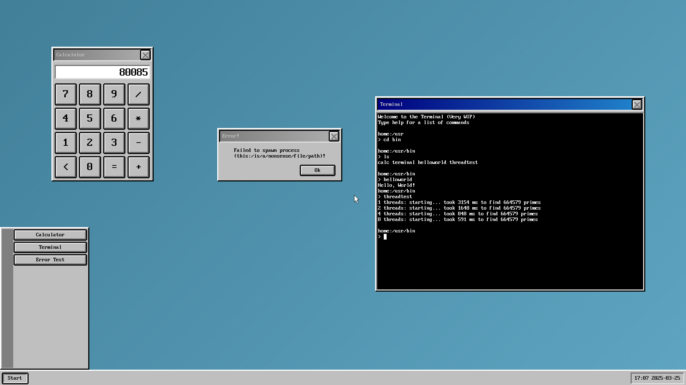

# PatchworkOS 

**Keep in mind that PatchworkOS is currently in a very early stage of development.**

Patchwork is a 64 bit monolithic hobbyist OS built from scratch in C for the x86_64 architecture, it is intended as an easy-to-modify toy-like Unix-inspired OS (not Unix-like) it takes many ideas from Unix while simplifying them and removing some of the fat. Made entirely for fun.
## Screenshots



## Differences with Unix

- Multiroot filesystem, with labels not letters ```home:/usr/fonts```
- Replaced ```fork(), exec()``` with ```spawn()```
- Single-User
- Non POSIX standard library
- GUI centric design
- Lots of other stuff...

## Features

- Easy to understand Unix inspired architecture (Not Unix-like)
- Monolithic preemptive 64-bit kernel
- SMP (Symmetric Multiprocessing)
- Multithreading (Kernel Level Threads)
- O(1) scheduler
- Custom standard library
- Custom UEFI bootloader
- SIMD
- [Custom image format (.fbmp)](https://github.com/KaiNorberg/fbmp)
- Plan9 inspired strict adherence to "Everything is a file"
- More to be added...

## Limitations

- Ram disks only
- Only x86_64

## Tested Hardware Configurations

- Lenovo Thinkpad E495
- Ryzen 5 3600X | 32GB 3200MHZ Corsair Vengeance

Currently untested on Intel hardware.

## Setup

<ins>**1. Cloning**</ins>

To clone this repository, you can either use the ```Code``` button at the top left of the screen on GitHub, or if you have [Git](https://git-scm.com/) installed, run the ```git clone --recursive https://github.com/KaiNorberg/PatchworkOS``` command.

<ins>**2. Building**</ins>

Before building Patchwork, ensure you have make, gcc, nasm and mtools installed, you will need to use Linux.

Once everything is installed, navigate to the cloned repository and run the ```make all``` command. You should then find a ```PatchworkOS.img``` file in the newly created bin directory.

<ins>**3. Running**</ins>

There are three ways to run Patchwork.

1. **Create a Bootable USB:** Use a tool like [balenaEtcher](https://etcher.balena.io/) to create a bootable USB using the created .img file.
2. **Use QEMU:** Download [QEMU](https://www.qemu.org/) and use the ```make run``` command.
3. **Other Virtual Machine:** Run the created .img file in a virtual machine of your choice.

## Documentation (WIP)

Documentation will eventually be found on the [wiki](https://github.com/Kaj9296/PatchworkOS/wiki) page.

## Contributing

Patchwork is now open to contribution. If you find any bugs, issues or just have a suggestion for something I could do better, then feel free to open an issue or if you feel like it, you may submit a pull request. 

Due to the small size of the project there are no strict guidelines, simply try to use descriptive branch names and commit messages, follow the code style of the rest of the project and the clang-format file and ensure your contributions comply with licensing. I will try to make a list of features to be added or bugs to be fixed when i have the time.

The guidelines may expand in the future as necessary.
