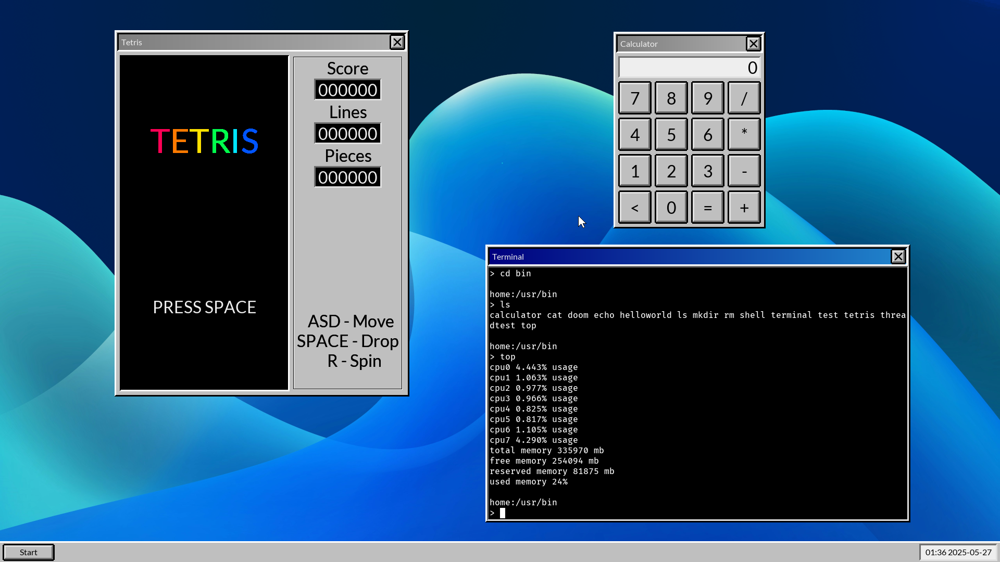
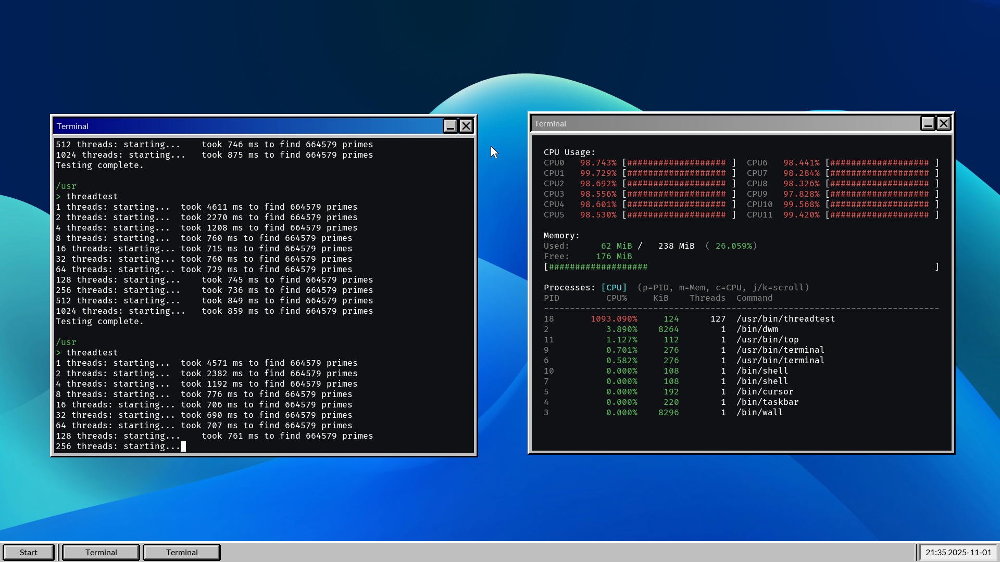
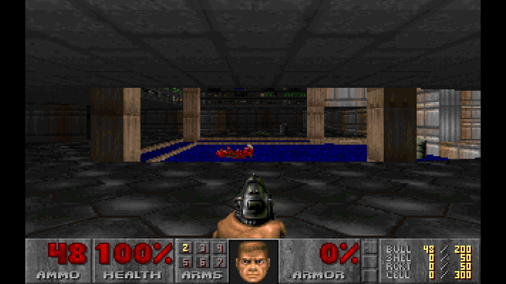

# PatchworkOS

<div align="center">
    <a href="https://github.com/KaiNorberg/PatchworkOS/issues">
      
    </a>
    <a href="https://github.com/KaiNorberg/PatchworkOS/stargazers">
      
    </a>
    <a href="https://kainorberg.github.io/PatchworkOS/html/index.html">
      
    </a>
    <a href="https://github.com/KaiNorberg/PatchworkOS/blob/main/license">
      
    </a>
    <a href="https://github.com/KaiNorberg/PatchworkOS/actions/workflows/test.yml">
        
    </a>
</div>



## Setup

```bash
# Install dependencies
sudo dnf install gcc make mtools qemu-system-x86 # For Fedora
sudo apt install build-essential mtools qemu-system-x86 # For Debian/Ubuntu

# Clone this repository, you can also use the green Code button at the top of the Github.
git clone https://github.com/KaiNorberg/PatchworkOS
cd PatchworkOS

# Build (creates PatchworkOS.img in bin/)
make all

# Run using QEMU
make run
```

## Introduction

**PatchworkOS** is a non-POSIX operating system written from scratch in C and assembly that takes inspiration from many sources, such as an "everything is a file" philosophy from Plan9, asynchronous IRP based I/O from Windows NT and io_uring from Linux.

This is not a UNIX clone; it's intended to be a (hopefully) interesting experiment in operating system design while remaining approachable and educational. Sometimes this leads to bad results, and sometimes, with a bit of luck, good ones.

The goal is still to make a “real” operating system, one that runs on real hardware and has the performance one would expect from a modern operating system without jumping ahead to user space features or drivers, a floppy disk driver with a round-robin scheduler is not enough.

Will this project ever reach its goals? Probably not, but that’s not the point.

<table>
<tr>
<td width="50%" valign="top" align="center">
  
  <br>
  <i>Stress test showing ~100% utilization across 12 CPUs.</i>
</td>
<td width="50%" valign="top" align="center">
  
  <br>
  <i>DOOM running on PatchworkOS using a <a href="https://github.com/ozkl/doomgeneric">doomgeneric</a> port.</i>
</td>
</tr>
</table>

## Philosophy

There are a few concepts that form the core of PatchworkOS, "everything is a file", asynchronous I/O, capability based security and others.

### Everything is a File

The "everything is a file" philosophy means that almost all kernel resources are exposed as files, where a file is defined as an object that can be interacted with "like a file", as in it can be opened, read, written, and closed.

> The file concept is distinct from a "regular file", which is a specific type of file that is stored on a disk and is what most people think of when they hear the word "file".

This can often result in unorthodox APIs that seem overcomplicated at first, but the goal is to provide a simple, consistent and most importantly composable interface for all kernel subsystems. The core argument is not that each individual API is better than its POSIX counterpart, but that they combine to form a system that is greater than the sum of its parts, allowing for behavior that was never explicitly designed for.

Plus its fun.

### Modernized I/O

The I/O system is designed from the ground up to take advantage of several modern I/O concepts. For example, all open/walk operations use `openat()` semantics, all I/O is vectored (uses scatter-gather lists), asynchronous and dispatched via an I/O Ring supporting timeouts and cancellation. Finally, all I/O is direct and (more or less) zero-copy. This is done with the goal of creating a powerful, flexible and efficient I/O system that can be used for a wide variety of purposes.

There are two components to asynchronous I/O, the I/O Ring and I/O Request Packets.

The I/O Ring acts as the user-kernel space boundary and is made up of two queues mapped into user space. The first queue is the submission queue, which is used by the user to submit I/O requests to the kernel. The second queue is the completion queue, which is used by the kernel to notify the user of the completion of I/O requests. This system also features a virtual register system, allowing I/O Requests to store the result of their operation to a virtual register, which another I/O Request can read from into their arguments, allowing for very complex operations to be performed asynchronously.

The I/O Request Packet is a self-contained structure that contains the information needed to perform an I/O operation. When the kernel receives a submission queue entry, it will parse it and create an I/O Request Packet from it. The I/O Request Packet will then be sent to the appropriate vnode (file system, device, etc.) for processing, once the I/O Request is completed, the kernel will write the result of the operation into the completion queue.

For reading or writing, the I/O Request Packet uses a Scatter Gather List, which is an array of entries, each containing a page frame number, offset and length. These are created by reading the user space `iovec_t` structures from the submission queue entry and converting them into page frame numbers. Finally, since the kernel identity maps all of physical memory into its address space, it can directly read from or write to the user space buffers without needing to copy them into kernel space or even map them in, thus achieving direct and zero-copy I/O.

Built on top of this system are several layers of abstractions. For example, the `iowrite()` function is a simple synchronous wrapper around the I/O ring and of course `fwrite()` is a wrapper around `iowrite()` that works as expected. Many helper functions are also provided, for example `iowritep()` is a version of `iowrite()` that will use the virtual register system to perform an open, write and close using a single system call.

Finally, even the "error" handling or status system allows for certain optimizations. For example, if a read is performed on a file such that no more data remains, the returned status will be an informational `ST_CODE_EOF` status. In certain cases, this means we can skip an additional read to check for EOF, potentially skipping a system call.

The combination of this system and our "everything is a file" philosophy means that since files are interacted with via asynchronous I/O and everything is a file, practically all operations can be asynchronous and dispatched via a I/O Ring.

### Security

In PatchworkOS, there are no Access Control Lists, user IDs or similar mechanisms. Instead, PatchworkOS uses a capability security model based on file descriptors.

A process can only access files that have been passed to it via file descriptors, and since everything is a file, this applies to practically everything in the system, including devices, IPC mechanisms, etc.

#### The `..` Operator

The `..` or dotdot operator is a major security concern in a capability based system. Consider that if we pass a directory to a process that process could use `..` to access the parent directory and then the parent of the parent and so on. This vulnerability would effectively make capability based security meaningless.

A tempting solution, used by other capability based systems, is to ban the use of `..` entirely and instead use string parsing to normalize paths (i.e. turning `a/b/..` into `a`). There are two primary issues with this solution, relative paths and symlinks.

As an example of a relative path, consider the path `./..`. The issue we encounter is that we may not know what `.` refers to, requiring us to track the current working directory as a string. This is not only complex but also inefficient as we would need to parse the entire path string for every traversal and also start any path traversal from the root directory instead of being able to start from any file descriptor.

We are still left with the problem of symlinks. Consider the path `a/b/../c`, if `b` is a symlink, and we proceed to normalize this path to `a/c`, we will end up accessing `c` within `a` not within whatever directory the symlink points to, making symlinks pointless.

There are alternative and superior solutions to this problem. However hopefully the point is clear, simply banning `..` is not a good solution due to the complexity and inefficiency it introduces, and the fact that symlinks become difficult to impossible to implement. That's not even mentioning the potential for race conditions when normalizing paths.

The solution proposed by PatchworkOS comes from the realization that `..` is not inherently dangerous. Instead, it is only dangerous when it can be used to grant additional capabilities.

As such we allow `..` if the process can prove that it already has a capability to reach the parent directory. For example, say we have a directory structure as described below.

```
/
├── a
│   ├── b
│   │   └── c
```

Now let's say we have a process that wishes to open the `b` directory and that has two file descriptors, one to the `c` file (as in it has the capability to access `c`) and one to the `a` directory (as in it has the capability to access `a`, the contents of `a` and the contents of all subdirectories).

In this case, if we disallow the process from using `..` from `c` to access `b`, we are not meaningfully preventing the process from accessing `b`, since it can just use the `a` file descriptor to access `b` directly. From this perspective, using `..` from `c` is merely a more convenient way to access `b`, not that doing so actually grants any new capabilities to the process.

However, if the process didn't have a file descriptor to `a` then allowing it to use `..` from `c` would grant additional capabilities and as such should not be allowed.

All of this does however hinge on the ability for a process to prove that it has a capability to access the parent directory. The way this is done is closely tied to how PatchworkOS handles the "root directory."

#### The Root Directory

In PatchworkOS there is no global root or even local root. Instead, when a process walks a path it must always specify some file descriptor to be considered the root for that specific operation.

This root file descriptor has three purposes. First, it is used to implement paths starting with `/`, letting paths start from the root file descriptor.

Second, it is used by a process to provide the proof discussed in the `..` section. If the process tries to use `..` to access the parent directory, the kernel will check if the specified root can reach that parent directory, if it can, then `..` acts as expected, otherwise `..` becomes a no-op to replicate expected POSIX-like behavior (e.g `/../../` is equivalent to `/`).

Finally, the root file descriptor stores bindings. Within PatchworkOS, there is no namespace or per-process mountpoints. Instead, each file object stores a table of bindings. These bindings act as one would expect within POSIX, allowing a file to appear at a different path than its actual location within the filesystem hierarchy. When a bind is performed, that bind will only apply when walking paths from the file object whose binding table the bind was added to.

In this system one can consider binding a file to be nothing more than a convenient way to pass multiple capabilities (file descriptors) within a single file descriptor, by binding paths within its binding table. It does also allow all the expected benefits of bindings or mounts from POSIX-like systems but from a different perspective.

### Standard Library

The standard library (libstd) is a superset of the ANSI C standard library, meaning that headers such as `<stdio.h>` and `<stdlib.h>` are included while POSIX headers such as `<unistd.h>` are not. Instead, the `sys` directory provides a set of PatchworkOS-specific headers such as `<sys/io.h>` and `<sys/proc.h>`.

Overall, an attempt is made to reuse and integrate our extensions cleanly without duplicating the ANSI sections of the standard library, for example the C11 `<threads.h>` header provides threading with `<sys/proc.h>` intentionally mirroring its API.

## Practical Examples

Included below are some practical examples of how to use the APIs provided by PatchworkOS, and how they differ from their POSIX counterparts. These examples are not meant to be comprehensive, but rather to provide an instinct and intuition for how PatchworkOS works.

### Basic File I/O

For a basic example of file I/O, let's say we wanted to open a file, write "Hello, World!" to it and then close it.

In a POSIX system, we might write:

```c
int fd = open("/path/to/file", O_RDWR);
write(fd, "Hello, World!", 13);
close(fd);
```

Using the synchronous I/O wrappers in PatchworkOS, we would write:

```c
fd_t fd;
iowalk(FDCWD, FDROOT, "/path/to/file:rw", &fd);

size_t bytesWritten;
iowrite(fd, IOBUF("Hello, World!", 13), IOCUR, &bytesWritten);
iodrop(fd);
```

We first open the file using `iowalk()`, specifying the default current working directory and root directory along with a path. Within the path we specify that we want "read and write" permissions (`:rw` see [Path Flags and Payloads](#Path Flags and Payloads)).

> The term "walk" is used instead of "open" since all operations act on file descriptors and the ability to reach files relative to other files is a key part of the security model. As such, performing any operation on a file should be thought of as "walking" to it and then acting upon it, instead of merely "opening" it, after walking to a file we could walk to another file relative to it.

Note that the `FDCWD` and `FDROOT` constants are just standard file descriptors like `STDIN`, `STDOUT` and `STDERR` (called `FDIN`, `FDOUT` and `FDERR` respectively). In PatchworkOS, the current working directory and root directory are just file descriptors like any other; an agreed upon convention that allows other processes to easily inherit them as needed.

Then we write to the file using `iowrite()`, passing the file descriptor, a buffer containing the data to write (the `iowrite()` function actually expects an array of `iovec_t` which the `IOBUF()` macro creates on the stack for convenience) and the offset to write at (in this case `IOCUR` to write at the current offset).

Finally, we close the file using `iodrop()`.

> The term "drop" is used instead of "close" to cleanly differentiate between closing a file and closing a file descriptor. We only use the terms "open" and "close" when referring to the underlying file (`file_t`), while using terms such as "grab" and "drop" when referring to file descriptors (`fd_t`).

The `iowritet()`, `ioreadt()` and `iowalkt()` functions are also provided that expect an additional `clock_t timeout` argument. There is also an event loop based abstraction around the I/O Ring itself provided via macros with the `Q` suffix.

#### Path Flags and Payloads

A path can contain two additional optional segments, path flags and a payload. Path flags are appended after a `:` character and can be written in two forms, either in full form or in short form with the short form being a single letter that can be specified in groups. For example, `/my/path:read:write:execute` could also be written as `/my/path:rwx`. Note that the order of the letters and duplicates are ignored.

Beyond simple permission flags we have behavior flags such as `:append`, `:parents`, `:truncate`, etc. or creation flags, `:create`, `:directory`, `:symlink` and `:hardlink`. With the simple `:create` creating a regular file.

The payload of a path is specified after a `?` character, this payload is treated as a raw string and will be passed to the underlying filesystem, allowing it to handle the payload in any way it chooses. However, typically filesystems will expect an options list in the form of key-value pairs separated by `&` characters.

For example, we could create a symlink by walking the path `/my/path/to/source:symlink?/my/path/to/target`.

Another example is concatfs which is used to concatenate the contents of several directories into a single directory. It expects the targets of the concatenation to be specified in the payload to its clone file, for example `/sys/fs/concatfs/clone?targets=1,2,3,4` where 1, 2, 3 and 4 are file descriptors.

The primary intent behind the use of the flags and payload system is to allow for greater composability. With this system, any environment that can open a file, a Lua script, a shell, etc. can create any file, directory, symlink or hardlink with any permissions and flags without needing to rely on custom "PatchworkOS extensions".

One can as an exercise imagine the potential of a basic "touch" shell utility with this system.

### Process Creation

Let's say we wanted to create a process, redirect its standard I/O to a set of file descriptors and then execute a program.

In a POSIX system, we might write:

```c
int in[2];
int out[2];
  
pipe(in);
pipe(out);

pid_t pid = fork();
if (pid == 0)
{
    dup2(in[0], 0);
    dup2(out[1], 1);
    close(in[1]);
    close(out[0]);
    execl("/path/to/program", "program", NULL);
}
```

Using the synchronous I/O wrappers in PatchworkOS, we would write:

```c
fd_t in;
fd_t out;

iowalk(FDCWD, FDROOT, "/dev/pipe/clone", &in);
iowalk(FDCWD, FDROOT, "/dev/pipe/clone", &out);

proc_fd_t fds = {{.parent = in, .child = 0}, {.parent = out, .child = 1}};
fd_t proc;
proc_create(FDCWD, FDROOT, PROC_ARGS("/path/to/program"), &fds, ARRAY_SIZE(fds), PRIO_MAX_USER, PROC_DEFAULT, &proc);
```

We first create two pipes by opening the special file `/dev/pipe/clone` twice.

Then we create a new process using the `proc_create()` function. This function takes in several arguments, first it takes in the root and current working directory to use when resolving paths, then it takes in a `proc_args_t` structure containing the command line arguments for the process which we use the `PROC_ARGS()` helper to construct. The second argument is an array of `proc_fd_t` structures allowing us to pass file descriptors to the child, where each `proc_fd_t` structure contains a parent file descriptor and a child file descriptor. The third argument is the size of this array which we use the `ARRAY_SIZE()` helper to compute. The fourth and fifth arguments are the process's priority and flags, and the sixth argument is an output pointer for a file descriptor to the child's proc directory containing files for manipulating the child.

We could optimize the pipe creation by walking to the second pipe relative to the first one. This optimization can be applied any time we wish to open the same file multiple times:

```c
fd_t in;
fd_t out;
iowalk(FDCWD, FDROOT, "/dev/pipe/clone", &in);
iowalk(in, FDROOT, ".", &out);
```

It's important to note that `proc_create()` is not a system call; it's a wrapper around the `/proc/clone` file which when opened returns the root of the new processes proc directory. The kernel does nothing more than provide an empty address space that `proc_create()` fills using the `mem` file in the child's proc directory.

A process will be freed when its reference count reaches zero, as such "killing" a process is merely freeing its threads to drop their references to the process.

### Environment Variables

Environment variables are typically a set of key-value pairs that provide a simple way to configure programs. This concept of environment variables maps cleanly to a directory containing files, where the name of the file is the key and its contents are the value. As such, environment variables are provided via a binding in the `/env` directory. This directory could either be a real directory, allowing the user to manage environment variables via the filesystem, or one could create a tmpfs instance and use that as the `/env` directory.

### Notes/Signals

Notes are PatchworkOS's equivalent to POSIX signals which asynchronously send strings to processes.

In POSIX, if a page fault were to occur in a process running in some form of shell, we would usually receive a `SIGSEGV`, which is not very helpful. The core limitation is that signals are just integers, so we can't receive any additional information.

In PatchworkOS, a note is a string where the first word of the string is the note type and the rest is arbitrary data. As such, a page fault note might look like:

```bash
shell: pagefault at 0x40013b when reading present page at 0x7ffffff9af18
```

All that happened is that the shell printed the exit status of the process, which is also a string and in this case is set to the note that killed the process.

### Mounting a Filesystem

There is no `mount()` system call in PatchworkOS; instead filesystems are exposed via files which are used in combination with the `fdbind()` function to mount filesystems.

Filesystem files are exposed by "sysfs" as directories, for example, `/sys/fs/tmpfs` is the filesystem directory for the tmpfs filesystem. Within these directories are "clone" files. Opening one of these clone files (for example `/sys/fs/tmpfs/clone`) gives us a file descriptor containing the root of a new instance of that filesystem (for more complex filesystems, for example a disk based one, additional parameters might be needed within the payload specified in `iowalk()` when opening the filesystem file).

Then we can use `fdbind()` to bind the root of the filesystem instance into our desired target:

```c
fd_t fs;
fd_t target;
iowalk(FDCWD, FDROOT, "/sys/fs/tmpfs/clone", &fs);
iowalk(FDCWD, FDROOT, "/mnt/tmpfs", &target);
fdbind(FDROOT, target, fs);
```

## Components (WIP)

In PatchworkOS, user space is made up of "components". These components can be anything, executable programs, libraries, headers, or just data files.

Each component is stored in a `/comp/<name>` directory. Within each components directory are version directories written in the form `<x>.<y>.<z>` (major.minor.patch).

The actual component files are stored within the version directories, usually within subdirectories like `bin/`, `lib/`, `include/`, etc. In addition, there is a manifest file which describes the component, its dependencies, and what capabilities it requires.

These manifests are written in a simple markup language made for PatchworkOS called S-expression CONfig (SCON), a parser is provided in libstd with the purpose of standardizing any configuration files used throughout the OS.

Included below is an example manifest file:

```lisp
(component
    (description "An example component.")
    (author "Kai Norberg")
    (license MIT)
    (launch bin/example)
    (dependencies
        (libstd 1.0.0)
    )
    (capabilities
        /dev/fb
        /dev/kbd
    )
)
```

### Launching Components

Any process can launch a component using the `comp_launch()` function from libstd. This function will construct a new root file descriptor for the component, with all the directories and files within the components directory and any dependencies directories, being concatenated via concatfs into a set of standard directories such as `/bin`, `/lib`, etc. and with any additional files specified via the capabilities being bound to the expected locations.

Let's take the component described above as an example. The libstd component provides a `lib/libstd.so` file and let's also say that libother provides a `lib/libother.so` file. In this case, the launched process would then find both `libstd.so` and `libother.so` in `/lib`. It would also be able to access see the `/dev/fb/`, `/dev/kbd`, as those were specified directly.

The `comp_launch()` function will automatically handle versioning via Minimum Version Selection inspired by GO, this means that the system will always choose the lowest possible version of components that satisfies all dependencies. Meaning that the version specified in a manifest might not be the version that's loaded, instead the version specified is the minimum version.

This ensures that the system is reproducible, that any updates have to be explicit ensuring that an update never breaks the system and that rollbacks are effortless (with the potential for some auto update system in the future) as the same set of dependencies will always result in the same environment, given the same manifests.

This all has one rather large limitation, in that the parent process must have all the capabilities to be passed to the child. If the child needs a capability that the parent does not have, the `comp_launch()` function will fail.

### The Init Process

The one exception to this rule is the init process, which is special in that it is the only process "loaded" by the kernel (it is actually loaded by the bootloader and the kernel simply copies the executable into memory) since executable loading is handled in user-space. The init process is granted a `FDROOT` file descriptor to the root of `sysfs` from which it can acquire all capabilities. It uses these capabilities to load the RAM disk and setup user space.

This means that the security model forms a tree-like structure, with init having all capabilities and all child processes having some subset of those capabilities.

## Modules

PatchworkOS uses a "modular" kernel design, meaning that instead of having one big kernel binary, the kernel is split into several smaller "modules" that can be loaded and unloaded at runtime.

This is highly convenient for development, but it also has practical advantages, for example, there is no need to load a driver for a device that is not attached to the system, saving memory.

> While the kernel used by PatchworkOS is distinctly (and intentionally) not a micro-kernel, drivers are loaded into the kernel, it does share some design ideas with micro-kernel designs. We try to design the kernel such that it is only responsible for the mechanism required to perform some task while user space is responsible for policy. For example, process and module loading is handled in user-space, and, as time goes on, the usage of 9P for services will most likely further reduce the size of the kernel.

### The Module Manager (modman)

The module manager is a user-space component, being no different to any other component, that is granted two capabilities the `/dev/announce` file and the `/sys/mod` directory.

The `/dev/announce` file allows the kernel to provide user-space with a stream of messages describing device state changes. Usually, a device being attached or detached. For example:

```
123456789 attach PNP0303 - \_SB_.PCI0.SF8_.KBD_
```

> Details on this format can be found the <comp/core/kernel-headers/include/kernel/drivers/announce.h> file.

When the module manager receives a massage like the one above, it will look inside the `/comp/.index/devices` directory, in which there are subdirectories named after each device type, in this case this would be the `/comp/.index/devices/PNP0303` directory. Inside that subdirectory is a series of symlinks to components that provide kernel modules that are able to handle that device type.

Some modules may return a "DEFERRED" status, this would cause the module manager to defer the loading of that module and try again when any new device is attached.

### Make your own Module

Making a module is intended to be as straightforward as possible. For the sake of demonstration, we will create a simple "Hello, World!" module.

Since kernel modules are just components, we must first create a new component. We begin by creating the `comp/hello` directory, in which we must create a `manifest.scon` file for our component, to which we write the following code:

```lisp
(component
    (description "Example Hello World module.")
    (author "Your name here")
    (license MIT)
    (module mod/hello.ko)
)
```

This file specifies basic metadata about our component, most importantly that it provides a kernel module which the module manager can find at `mod/hello.ko` within our components directory.

Now we can create a `hello.mk` file, in the same directory as the manifest file, to which we write the following code:

```bash
COMP_NAME = hello
COMP_VERSION = 1.0.0
COMP_TYPE = module
COMP_DEVICES = BOOT_ALWAYS

include $(COMP_DIR)/Make.comp.defaults
include $(COMP_DIR)/Make.comp.rules
```

This `.mk` file describes our component to the build system, giving it its name, version, type and most importantly what devices it can handle. In this case we specify `BOOT_ALWAYS` which is a special device that the module manager will pretend was attached during boot, allowing modules that specify it to always be loaded.

> Note that the `hello.mk` will cause the build system to create a symlink at `/comp/.index/devices/BOOT_ALWAYS/hello` pointing to our component at `/comp/hello/1.0.0`.

We are now able to write the actual module, we will create a `src` directory within `comp/hello` within which we create a `hello.c` file containing the included code:

```c
#include <kernel/module/module.h>
#include <kernel/log/log.h>

status_t _module_procedure(const module_event_t* event)
{
    switch (event->type)
    {
    case MODULE_EVENT_LOAD:
        LOG_INFO("Hello, World!\n");
        break;
    default:
        break;
    }

    return OK;
}
```

The final directory structure should look something like this:

```
/
├── comp
│   ├── hello
│   │   ├── src
│   │   │   └── hello.c
│   │   ├── manifest.scon
│   │   └── hello.mk
```

We can now run the `make all run` command and should see a "Hello, World!" message within the kernels logs during boot.

If this didn't work, or bugs are encountered, please open an issue.

## ACPI (WIP)

PatchworkOS features a from-scratch ACPI implementation and AML parser, with the goal of being, at least by ACPI standards, easy to understand and educational. It is tested on the [Tested Configurations](#tested-configurations) below and against [ACPICA's](https://github.com/acpica/acpica) runtime test suite, but remains a work in progress (and probably always will be).

See [ACPI Documentation](https://kainorberg.github.io/PatchworkOS/html/d1/d39/group__modules__acpi.html) for a progress checklist.

See [ACPI specification Version 6.6](https://uefi.org/specs/ACPI/6.6/index.html) as the main reference.

### What is ACPI?

ACPI or Advanced Configuration and Power Interface is used for *a lot* of things in modern systems but mainly power management and device enumeration/configuration. It's not possible to go over everything here, instead a brief overview of the parts most likely to cause confusion while reading the code will be provided.

It consists of two main parts, the ACPI tables and AML bytecode. If you have completed a basic operating systems tutorial, you have probably seen the ACPI tables before, for example the RSDP, FADT, MADT, etc. These tables are static in memory data structures storing information about the system; they are very easy to parse but are limited in what they can express.

AML or ACPI Machine Language is a Turing complete "mini language", and the source of much frustration, that is used to express more complex data, primarily device configuration. This is needed as its impossible for any specification to account for every possible hardware configuration that exists currently, much less that may exist in the future. So instead of trying to design that, what if we could just have a small program generate whatever data we wanted dynamically? Well that's more or less what AML is.

### Device Configuration

To demonstrate how ACPI is used for device configuration, we will use the [PS/2 driver](https://kainorberg.github.io/PatchworkOS/html/d9/d70/group__modules__drivers__ps2.html) as an example.

If you have followed a basic operating systems tutorial, you have probably implemented a PS/2 keyboard driver at some point, and most likely you hardcoded the I/O ports `0x60` and `0x64` for data and commands respectively, and IRQ `1` for keyboard interrupts.

Using this hardcoded approach will work for the vast majority of systems, but, perhaps surprisingly, there is no standard that guarantees that these ports and IRQs will actually be used for PS/2 devices. It's just a silent agreement that pretty much all systems adhere to for legacy reasons.

But this is where the device configuration from AML comes in, it lets us query the system for the actual resources used by the PS/2 keyboard, so we don't have to rely on hardcoded values.

If you were to decompile the AML bytecode into its original ASL (ACPI Source Language), you might find something like this:

```asl
Device (KBD)
{
    Name (_HID, EisaId ("PNP0303") /* IBM Enhanced Keyboard (101/102-key, PS/2 Mouse) */)  // _HID: Hardware ID
    Name (_STA, 0x0F)  // _STA: Status
    Name (_CRS, ResourceTemplate ()  // _CRS: Current Resource Settings
    {
        IO (Decode16,
            0x0060,             // Range Minimum
            0x0060,             // Range Maximum
            0x01,               // Alignment
            0x01,               // Length
            )
        IO (Decode16,
            0x0064,             // Range Minimum
            0x0064,             // Range Maximum
            0x01,               // Alignment
            0x01,               // Length
            )
        IRQNoFlags ()
            {1}
    })
}
```

*Note that just like C compiles to assembly, ASL compiles to AML bytecode, which is what the OS actually parses.*

In the example ASL, we see a `Device` object representing a PS/2 keyboard. It has a hardware ID (`_HID`), which we can cross-reference with an [online database](https://uefi.org/PNP_ACPI_Registry) to confirm that it is indeed a PS/2 keyboard, a status (`_STA`), which is just a bit field indicating if the device is present, enabled, etc., and finally the current resource settings (`_CRS`), which is the thing we are really after.

The `_CRS` might look a bit complicated but focus on the `IO` and `IRQNoFlags` entries. Notice how they are specifying the I/O ports and IRQ used by the keyboard? Which in this case are indeed `0x60`, `0x64` and `1` respectively. So in this case the standard held true.

So how is this information used? During boot, the `_CRS` information of each device is parsed by the ACPI subsystem, it then queries the kernel for the needed resources, assigned them to each device and makes the final configuration available to drivers.

Then when the PS/2 driver is loaded, it gets told "you are handling a device with the name `\_SB_.PCI0.SF8_.KBD_` (which is just the full path to the device object in the ACPI namespace) and the type `PNP0303`", it can then query the ACPI subsystem for the resources assigned to that device, and use them instead of hardcoded values.

Having access to this information for all devices also allows us to avoid resource conflicts, making sure two devices are not trying to use the same IRQ(s) or I/O port(s).

Of course, it gets way, way worse than this, but hopefully this clarifies why the PS/2 driver and other drivers, might look a bit different from what you might be used to.

## Other Features

### Kernel

- Preemptive and tickless [EEVDF scheduler](https://kainorberg.github.io/PatchworkOS/html/d7/d85/group__kernel__sched.html) based upon the [original paper](https://citeseerx.ist.psu.edu/document?repid=rep1&type=pdf&doi=805acf7726282721504c8f00575d91ebfd750564) and implemented using an [Augmented Red-Black tree](https://kainorberg.github.io/PatchworkOS/html/da/d90/group__kernel__utils__rbtree.html) to achieve `O(log n)` worst case complexity. Providing a more approachable implementation of the scheduler used by the modern Linux kernel, but ours is obviously **a lot** less mature.
- Multithreading and Symmetric Multi Processing with fine-grained locking.
- Optimized memory management, featuring object caching and `O(1)` per page physical and virtual memory managers.
- File based IPC and driver abstractions.
- [Synchronization primitives](https://kainorberg.github.io/PatchworkOS/html/dd/d6b/group__kernel__sync.html) including Read-Copy-Update, mutexes, R/W locks, sequential locks, futex-inspired synchronization control objects and others.
- Highly [Modular design](#modules), even [SMP Bootstrapping](https://kainorberg.github.io/PatchworkOS/html/d3/d0a/group__modules__smp.html) is done in a module.
- From scratch ACPI implementation and AML parser, tested against ACPICA's runtime test suite. See [ACPI](#acpi) for more info.

### File System

- Vnode and dentry based VFS with RCU traversal, hardlinks, symlinks, Plan9 inspired union mounts via concatfs, etc.
- Custom [Framebuffer BitMaP](https://github.com/KaiNorberg/fbmp) (.fbmp) image format, allows for faster loading by removing the need for parsing.
- Custom [Grayscale Raster Font](https://github.com/KaiNorberg/grf) (.grf) font format, allows for antialiasing and kerning without complex vector graphics.

### User Space

- Capability security model. See [Security](#security) for more info.
- Dynamic Linker with GNU hashing.
- Note that currently a heavy focus has been placed on the kernel and low-level stuff, so user space is quite small... for now.

---

## Doxygen Documentation

As one of the main goals of PatchworkOS is to be educational and approachable, the codebase is extensively documented with citations provided to any used sources when reasonable.

For more, check out the [documentation](https://kainorberg.github.io/PatchworkOS/html/index.html). Within the documentation checking the `topics` section in the sidebar is recommended.

## Development

### Additional commands

```bash
# Clean build files
make clean

# Build with debug mode enabled
make all DEBUG=1

# Build with debug mode enabled and testing enabled (you will need to have iasl installed)
make all DEBUG=1 TESTING=1

# Debug using qemu with one cpu and GDB
make all run DEBUG=1 QEMU_CPUS=1 GDB=1

# Debug using qemu and exit on panic
make all run DEBUG=1 QEMU_EXIT_ON_PANIC=1

# Generate doxygen documentation
make doxygen

# Create compile commands file
make compile_commands
```

### Repo Structure

```plain
.
├── tools         // Utility tools.
├── vendor        // Third party files, for example doomgeneric.
├── meta          // Meta files, including screenshots, doxygen, etc.
├── boot          // UEFI bootloader source code.
├── comp          // Components, including kernel modules, source code, headers, data, etc.
├── init          // Init process source code.
└── kernel        // The sourc code for the kernel and its core subsystems.
```

Note that the kernels headers are found within `comp/core/kernel-headers/include` and standard library headers are found within `comp/core/libstd/include`.

### Grub Loopback

For frequent testing, it might be inconvenient to frequently flash to a USB. You can instead set up the `.img` file as a loopback device in GRUB.

Add this entry to the `/etc/grub.d/40_custom` file:

```bash
menuentry "Patchwork OS" {
        set root="[The grub identifer for the drive. Can be retrived using: sudo grub2-probe --target=drive /boot]"
        loopback loop0 /PatchworkOS.img # Might need to be modified based on your setup.
        set root=(loop0)
        chainloader /efi/boot/bootx64.efi
}
```

Regenerate grub configuration using `sudo grub2-mkconfig -o /boot/grub2/grub.cfg`.

Finally copy the generated `.img` file to your `/boot` directory, this can also be done with `make grub_loopback`.

You should now see a new entry in your GRUB boot menu allowing you to boot into the OS, like dual booting, but without the need to create a partition.

### Troubleshooting

- **QEMU boot failure**: Check if you are using QEMU version 10.0.0, as that version has previously caused issues. These issues appear to be fixed currently however consider using version 9.2.3
- **Any other errors?**: If an error not listed here occurs or is not resolvable, please open an issue in the GitHub repository.

## Testing

Testing uses a GitHub action that compiles the project and runs it for some amount of time using QEMU with `DEBUG=1`, `TESTING=1` and `QEMU_EXIT_ON_PANIC=1` set. This will run some additional tests in the kernel (for example it will clone ACPICA and run all its runtime tests), and if QEMU has not crashed by the end of the allotted time, it is considered a success.

Note that the `QEMU_EXIT_ON_PANIC` flag will cause any failed test, assert or panic in the kernel to exit QEMU using their "-device isa-debug-exit" feature with a non-zero exit code, thus causing the GitHub action to fail.

### Tested Configurations

- QEMU emulator version 9.2.3 (qemu-9.2.3-1.fc42)
- Lenovo ThinkPad E495
- Ryzen 5 3600X | 32GB 3200MHZ Corsair Vengeance

Currently untested on Intel hardware (broke student, no access to hardware). Let me know if you have different hardware, and it runs (or doesn't) for you!

## Roadmap

### Current Work

- Continue refactoring the kernel to replace synchronous code with asynchronous code.
- Replace local sockets with 9P file servers.
- Completely redo user-space to use new async and 9P, as the kernel has simply outgrown user-space.

### Notable Future Plans

- Consider if a GTK-inspired GUI could be performant enough using CPU rendering. Use transparency and prerendering for shadows?
- Port LUA and use it for dynamic system configuration.
- Driver support, for example USB.

### Known Limitations

- Currently limited to RAM disks only (Waiting for USB support).
- Only support for x86_64.

## Community

We use [GitHub Discussions](https://github.com/KaiNorberg/PatchworkOS/discussions) for announcements, progress updates and general discussions. As such, subscribing to the discussions or watching the repository is the best way to stay updated.

If you like PatchworkOS, consider starring the repository or donating via [GitHub Sponsors](https://github.com/sponsors/KaiNorberg) to support development.

### Contributing

Contributions are welcome! Anything from bug reports/fixes, performance improvements, new features, or even just fixing typos or adding documentation.

If you are unsure where to start, check the [Todo List](https://kainorberg.github.io/PatchworkOS/html/dd/da0/todo.html).

Check out the [contribution guidelines](CONTRIBUTING.md) to get started.

## License

Distributed under the MIT License. See [LICENSE](https://github.com/KaiNorberg/PatchworkOS/blob/main/LICENSE) for more information.

## Nostalgia

[The first Reddit post and image of PatchworkOS](https://www.reddit.com/r/osdev/comments/18gbsng/a_little_over_2_years_ago_i_posted_a_screenshot/) from back when getting to user space was a massive milestone and the kernel was supposed to be a UNIX-like microkernel.
