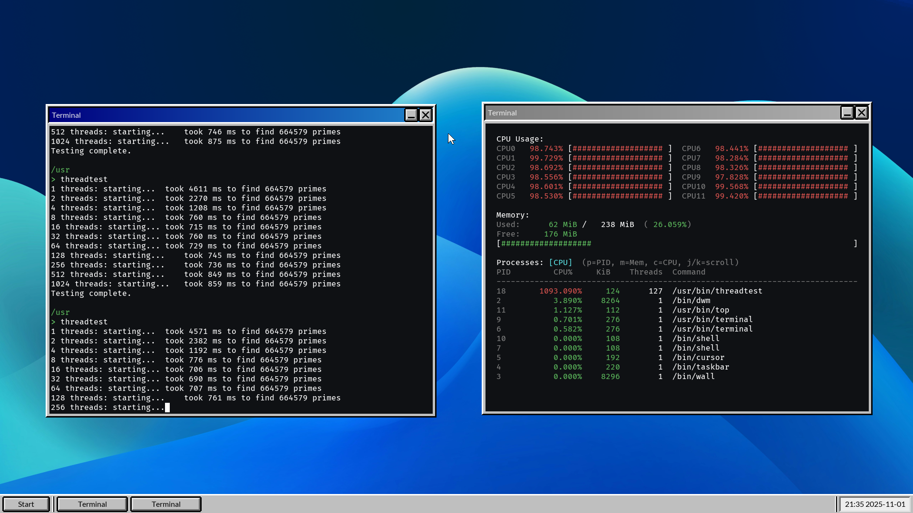

# PatchworkOS

<br>
<div align="center">
    <a href="https://github.com/KaiNorberg/PatchworkOS/issues">
      
    </a>
    <a href="https://github.com/KaiNorberg/PatchworkOS/stargazers">
      
    </a>
    <a href="https://kainorberg.github.io/PatchworkOS/html/index.html">
      
    </a>
    <a href="https://github.com/KaiNorberg/PatchworkOS/blob/main/license">
      
    </a>
    <a href="https://github.com/KaiNorberg/PatchworkOS/actions/workflows/test.yml">
        
    </a>
    <br>
    <i>PatchworkOS is currently in a very early stage of development, and may have both known and unknown bugs.</i>
</div>
<br>


**PatchworkOS** is a modular non-POSIX operating system for the x86_64 architecture that rigorously follows an "everything is a file" philosophy, in the style of Plan9. Built from scratch in C and assembly, it's intended to be an educational and experimental operating system.

While primarily a project made for fun, the goal is still to make a "real" operating system, one that runs on real hardware and has the performance one would expect from a modern operating system without jumping ahead to user space features or drivers, a floppy disk driver and a round-robin scheduler are not enough.

PatchworkOS is not a UNIX clone, it's intended to be a (hopefully) interesting experiment in operating system design by attempting to use unique algorithms and designs over tried and tested ones. Sometimes this leads to bad results, and sometimes, with a bit of luck, good ones.

Despite its experimental nature and scale, the project aims to remain approachable and educational, something that can work as a middle ground between fully educational operating systems like xv6 and production operating system like Linux.

Will this project ever reach its goals? Probably not, but that's not the point.

<table>
<tr>
<td width="50%" valign="top" align="center">
  
  <br>
  <i>Stress test showing ~100% utilization across 12 CPUs.</i>
</td>
<td width="50%" valign="top" align="center">
  
  <br>
  <i>DOOM running on PatchworkOS using a <a href="https://github.com/ozkl/doomgeneric">doomgeneric</a> port.</i>
</td>
</tr>
</table>

## Features

### Kernel

- Preemptive and tickless [EEVDF scheduler](https://kainorberg.github.io/PatchworkOS/html/d7/d85/group__kernel__sched.html) based upon the [original paper](https://citeseerx.ist.psu.edu/document?repid=rep1&type=pdf&doi=805acf7726282721504c8f00575d91ebfd750564) and implemented using an [Augmented Red-Black tree](https://kainorberg.github.io/PatchworkOS/html/da/d90/group__kernel__utils__rbtree.html) to achieve `O(log n)` worst case complexity. EEVDF is the same algorithm used in the modern Linux kernel, but ours is obviously **a lot** less mature.
- Multithreading and Symmetric Multi Processing with fine-grained locking.
- Physical and virtual memory management is `O(1)` per page and `O(n)` where `n` is the number of pages per allocation/mapping operation, see [benchmarks](#benchmarks) for more info.
- File based IPC including [pipes](https://kainorberg.github.io/PatchworkOS/html/d7/d64/group__modules__ipc__pipe.html), [shared memory](https://kainorberg.github.io/PatchworkOS/html/df/d3f/group__modules__ipc__shmem.html), [sockets](https://kainorberg.github.io/PatchworkOS/html/d4/db0/group__kernel__fs__netfs.html) and Plan9 inspired "signals" called [notes](https://kainorberg.github.io/PatchworkOS/html/d8/db1/group__kernel__ipc__note.html).
- File based device API [abstractions](https://kainorberg.github.io/PatchworkOS/html/de/d7b/group__kernel__drivers__abstract.html), including framebuffers, input devices, etc.
- [Synchronization primitives](https://kainorberg.github.io/PatchworkOS/html/dd/d6b/group__kernel__sync.html) including mutexes, read-write locks, sequential locks, futexes and others.
- Highly [Modular design](#modules), even [SMP Bootstrapping](https://kainorberg.github.io/PatchworkOS/html/d3/d0a/group__modules__smp.html) is done in a module.

### File System

- UNIX-style VFS with mountpoints, hardlinks, symlinks, per-process namespaces, etc.
- Custom [Framebuffer BitMaP](https://github.com/KaiNorberg/fbmp) (.fbmp) image format, allows for faster loading by removing the need for parsing.
- Custom [Grayscale Raster Font](https://github.com/KaiNorberg/grf) (.grf) font format, allows for antialiasing and kerning without complex vector graphics.

### User Space

- Custom superset of the ANSI C standard library including threading, file I/O, math, PatchworkOS extensions, etc.
- Highly modular shared memory based desktop environment.
- Theming via [config files](https://github.com/KaiNorberg/PatchworkOS/blob/main/root/cfg).
- Capability based containerization security model using per-process mountpoint namespaces. See [Security](#security) for more info.
- Note that currently a heavy focus has been placed on the kernel and low-level stuff, so user space is quite small... for now.

*And much more...*

## Limitations

- Currently limited to RAM disks only (Waiting for USB support).
- Only support for x86_64.

## Notable Future Plans

- Fix filesystem mounting vulnerability.
- File servers (FUSE, 9P?).
- Implement user system in user-space using namespaces.
- Improve `share()` and `claim()` security by specifying a target PID when sharing.
- Overhaul Desktop Window Manager to use the new security system and file servers?
- Port LUA and use it for dynamic system configuration.
- Fully Asynchronous I/O and syscalls (io_uring?).
- USB support.

---

## Doxygen Documentation

As one of the main goals of PatchworkOS is to be educational, I have tried to document the codebase as much as possible along with providing citations to any sources used. Currently, this is still a work in progress, but as old code is refactored and new code is added, I try to add documentation.

If you are interested in knowing more, then you can check out the Doxygen generated [documentation](https://kainorberg.github.io/PatchworkOS/html/index.html). For an overview check the `topics` section in the sidebar.

## Modules

PatchworkOS uses a "modular" kernel design, meaning that instead of having one big kernel binary, the kernel is split into several smaller "modules" that can be loaded and unloaded at runtime.

This is highly convenient for development, but it also has practical advantages, for example, there is no need to load a driver for a device that is not attached to the system, saving memory.

### Make your own Module

Making a module is intended to be as straightforward as possible. For the sake of demonstration, we will create a simple "Hello, World!" module.

First, we create a new directory in `src/kernel/modules/` named `hello`, and inside that directory we create a `hello.c` file to which we write the following code:

```c
#include <kernel/module/module.h>
#include <kernel/log/log.h>

#include <stdint.h>

uint64_t _module_procedure(const module_event_t* event)
{
    switch (event->type)
    {
    case MODULE_EVENT_LOAD:
        LOG_INFO("Hello, World!\n");
        break;
    default:
        break;
    }

    return 0;
}

MODULE_INFO("Hello", "<author>", "A simple hello world module", "1.0", "MIT", "BOOT_ALWAYS");
```

An explanation of the code will be provided later.

Now we need to add the module to the build system. To do this, just copy an existing module's `.mk` file without making any modifications. For example, we can copy `src/modules/drivers/ps2/ps2.mk` to `src/modules/hello/hello.mk`. The build system will handle the rest, including copying the module to the final image.

Now, we can build and run PatchworkOS using `make all run`, or we could use `make all` and then flash the generated `bin/PatchworkOS.img` file to a USB drive.

Now to validate that the module is working, you can either watch the boot log and spot the `Hello, World!` message, or you could use `grep` on the `/dev/klog` file in the terminal program like so:

```bash
cat /dev/klog | grep "Hello, World!"
```

This should output something like:

```bash
[   0.747-00-I] Hello, World!
```

That's all, if this did not work, make sure you followed all the steps correctly. If there is still issues, feel free to open an issue.

### What can I do now?

Whatever you want. You can include any kernel header, or even headers from other modules, create your own modules and include their headers or anything else. There is no need to worry about linking, dependencies or exporting/importing symbols, the kernels module loader will handle all of it for you. Go nuts.

### Code Explanation

This code in the `hello.c` file does a few things. First, it includes the relevant kernel headers.

Second, it defines a `_module_procedure()` function. This function serves as the entry point for the module and will be called by the kernel to notify the module of events, for example the module being loaded or a device attached. On the load event, it will print using the kernels logging system `"Hello, World!"`, resulting in the message being readable from `/dev/klog`.

Finally, it defines the modules information. This information is, from left to right, the name of the module, the author of the module (that's you), a short description of the module, the module version, the license of the module, and finally a list of "device types", in this case just `BOOT_ALWAYS`, but more could be added by separating them with a semicolon (`;`).

The list of device types is what causes the kernel to actually load the module. I will avoid going into too much detail (you can check the documentation for that), but I will explain it briefly.

The module loader itself has no idea what these type strings actually are, but subsystems can specify that "a device of the type represented by this string is now available", the module loader can then load either one or all modules that have specified in their list of device types that it can handle the specified type. This means that any new subsystem, ACPI, USB, PCI, etc., can implement dynamic module loading using whatever types they want.

So what is `BOOT_ALWAYS`? It is the type of special device that the kernel will pretend to "attach" during boot. In this case, it simply causes our hello module to be loaded during boot.

For more information, check the [Module Documentation](https://kainorberg.github.io/PatchworkOS/html/dd/d41/group__kernel__module.html).

## Everything is a File

PatchworkOS strictly follows the "everything is a file" philosophy in a way inspired by Plan9, this can often result in unorthodox APIs that seem overcomplicated at first, but the goal is to provide a simple, consistent and most importantly composable interface for all kernel subsystems, more on this later.

Included below are some examples to familiarize yourself with the concept. We, of course, cannot cover everything, so the concepts presented here are the ones believed to provide the greatest insight into the philosophy.

### Sockets

The first example is sockets, specifically how to create and use local seqpacket sockets.

To create a local seqpacket socket, you open the `/net/local/seqpacket` file. This is equivalent to calling `socket(AF_LOCAL, SOCK_SEQPACKET, 0)` in POSIX systems. The opened file can be read to return the "ID" of the newly created socket which is a string that uniquely identifies the socket, more on this later.

PatchworkOS provides several helper functions to make file operations easier, but first we will show how to do it without any helpers:

```c
fd_t fd = open("/net/local/seqpacket");
char id[32] = {0};
read(fd, id, 31); 
// ... do stuff ...
close(fd);
```

Using the `sread()` helper which reads a null-terminated string from a file descriptor, we can simplify this to:

```c
fd_t fd = open("/net/local/seqpacket");
char* id = sread(fd); 
close(fd);
// ... do stuff ...
free(id);
```

Finally, using use the `sreadfile()` helper which reads a null-terminated string from a file from its path, we can simplify this even further to:

```c
char* id = sreadfile("/net/local/seqpacket"); 
// ... do stuff ...
free(id);
```

> Note that the socket will persist until the process that created it and all its children have exited or the sockets directory is unmounted. Additionally, for error handling, all functions will return either `NULL` or `ERR` on failure, depending on if they return a pointer or an integer type respectively. The per-thread `errno` variable is used to indicate the specific error that occurred, both in user space and kernel space (however the actual variable is implemented differently in kernel space).

Now that we have the ID, we can discuss what it actually is. The ID is the name of a directory in the `/net/local` directory, in which the following files exist:

- `data`: Used to send and retrieve data
- `ctl`: Used to send commands
- `accept`: Used to accept incoming connections

So, for example, the sockets data file is located at `/net/local/[id]/data`.

Say we want to make our socket into a server, we would then use the `ctl` file to send the `bind` and `listen` commands, this is similar to calling `bind()` and `listen()` in POSIX systems. In this case, we want to bind the server to the name `myserver`.

Once again, we provide several helper functions to make this easier. First, without any helpers:

```c
char ctlPath[MAX_PATH] = {0};
snprintf(ctlPath, MAX_PATH, "/net/local/%s/ctl", id)
fd_t ctl = open(ctlPath);
const char* str = "bind myserver && listen"; // Note the use of && to send multiple commands.
write(ctl, str, strlen(str));
close(ctl);
```

Using the `F()` macro which allocates formatted strings on the stack and the `swrite()` helper that writes a null-terminated string to a file descriptor:

```c
fd_t ctl = open(F("/net/local/%s/ctl", id));
swrite(ctl, "bind myserver && listen")
close(ctl);
```

Finally, using the `swritefile()` helper which writes a null-terminated string to a file from its path:

```c
swritefile(F("/net/local/%s/ctl", id), "bind myserver && listen");
```

If we wanted to accept a connection using our newly created server, we just open its accept file:

```c
fd_t fd = open(F("/net/local/%s/accept", id));
/// ... do stuff ...
close(fd);
```

The file descriptor returned when the accept file is opened can be used to send and receive data, just like when calling `accept()` in POSIX systems.

For the sake of completeness, to connect the server we just create a new socket and use the `connect` command:

```c
char* id = sreadfile("/net/local/seqpacket");
swritefile(F("/net/local/%s/ctl", id), "connect myserver");
free(id);
```

[Documentation](https://kainorberg.github.io/PatchworkOS/html/d4/db0/group__kernel__fs__netfs.html)

### File Flags?

You may have noticed that in the above section sections the `open()` function does not take in a flags argument. This is because flags are directly part of the file path so to create a non-blocking socket:

```c
open("/net/local/seqpacket:nonblock");
```

Multiple flags are allowed, just separate them with the `:` character, this means flags can be easily appended to a path using the `F()` macro. Each flag also has a shorthand version for which the `:` character is omitted, for example to open a file as create and exclusive, you can do

```c
open("/some/path:create:exclusive");
```

or

```c
open("/some/path:ce");
```

For a full list of available flags, check the [Documentation](https://kainorberg.github.io/PatchworkOS/html/dd/de3/group__kernel__fs__path.html).

### Permissions?

Permissions are also specified using file paths there are three possible permissions, read, write and execute. For example to open a file as read and write, you can do

```c
open("/some/path:read:write");
```

or

```c
open("/some/path:rw");
```

Permissions are inherited, you can't use a file with lower permissions to get a file with higher permissions. Consider the namespace section, if a directory was opened using only read permissions and that same directory was bound, then it would be impossible to open any files within that directory with any permissions other than read.

For a full list of available permissions, check the [Documentation](https://kainorberg.github.io/PatchworkOS/html/dd/de3/group__kernel__fs__path.html).

### Spawning Processes

Another example of the "everything is a file" philosophy is the `spawn()` syscall used to create new processes. We will skip the usual debate on `fork()` vs `spawn()` and just focus on how `spawn()` works in PatchworkOS as there are enough discussions about that online.

The `spawn()` syscall takes in two arguments:

- `const char** argv`: The argument vector, similar to POSIX systems except that the first argument is always the path to the executable.
- `spawn_flags_t flags`: Flags controlling the creation of the new process, primarily what to inherit from the parent process.

The system call may seem very small in comparison to, for example, `posix_spawn()` or `CreateProcess()`. This is intentional, trying to squeeze every possible combination of things one might want to do when creating a new process into a single syscall would be highly impractical, as those familiar with `CreateProcess()` may know.

PatchworkOS instead allows the creation of processes in a suspended state, allowing the parent process to modify the child process before it starts executing.

As an example, let's say we wish to create a child such that its stdio is redirected to some file descriptors in the parent and create an environment variable `MY_VAR=my_value`.

First, let's pretend we have some set of file descriptors and spawn the new process in a suspended state using the `SPAWN_SUSPENDED` flag

```c
fd_t stdin = ...;
fd_t stdout = ...;
fd_t stderr = ...;

const char* argv[] = {"/base/bin/shell", NULL};
pid_t child = spawn(argv, SPAWN_SUSPENDED);
```

At this point, the process exists but its stuck blocking before it is can load its executable. Additionally, the child process has inherited all file descriptors and environment variables from the parent process.

Now we can redirect the stdio file descriptors in the child process using the `/proc/[pid]/ctl` file, which just like the socket ctl file, allows us to send commands to control the process. In this case, we want to use two commands, `dup2` to redirect the stdio file descriptors and `close` to close the unneeded file descriptors.

```c
swritefile(F("/proc/%d/ctl", child), F("dup2 %d 0 && dup2 %d 1 && dup2 %d 2 && close 3 -1", stdin, stdout, stderr));
```

> Note that `close` can either take one or two arguments. When two arguments are provided, it closes all file descriptors in the specified range. In our case `-1` causes a underflow to the maximum file descriptor value, closing all file descriptors higher than or equal to the first argument.

Next, we create the environment variable by creating a file in the child's `/proc/[pid]/env/` directory:

```c
swritefile(F("/proc/%d/env/MY_VAR:create", child), "my_value");
```

Finally, we can start the child process using the `start` command:

```c
swritefile(F("/proc/%d/ctl", child), "start");
```

At this point the child process will begin executing with its stdio redirected to the specified file descriptors and the environment variable set as expected.

The advantages of this approach are numerous, we avoid COW issues with `fork()`, weirdness with `vfork()`, system call bloat with `CreateProcess()`, and we get a very flexible and powerful process creation system that can use any of the other file based APIs to modify the child process. In exchange, the only real price we pay is overhead from additional context switches, string parsing and path traversals, how much this matters in practice is debatable.

For more on `spawn()`, check the [Userspace Process API Documentation](https://kainorberg.github.io/PatchworkOS/html/d1/d10/group__libstd__sys__proc.html#gae41c1cb67e3bc823c6d0018e043022eb) and for more information on the `/proc` filesystem, check the [Kernel Process Documentation](https://kainorberg.github.io/PatchworkOS/html/da/d0f/group__kernel__proc.html).

### Notes (Signals)

The next feature to discuss is the "notes" system. Notes are PatchworkOS's equivalent to POSIX signals which asynchronously send strings to processes.

We will skip how to send and receive notes along with details like process groups (check the docs for that), instead focusing on the biggest advantage of the notes system, additional information.

Let's take an example. Say we are debugging a segmentation fault in a program, which is a rather common scenario. In a usual POSIX environment, we might be told "Segmentation fault (core dumped)" or even worse "SIGSEGV", which is not very helpful. The core limitation is that signals are just integers, so we can't provide any additional information.

In PatchworkOS, a note is a string where the first word of the string is the note type and the rest is arbitrary data. So in our segmentation fault example, the shell might produce output like:

```bash
shell: pagefault at 0x40013b due to stack overflow at 0x7ffffff9af18
```

> Note that the output provided is from the "stackoverflow" program which intentionally causes a stack overflow through recursion.

All that happened is that the shell printed the exit status of the process, which is also a string and in this case is set to the note that killed the process. This is much more useful, we know the exact address and the reason for the fault.

For more details, see the [Notes Documentation](https://kainorberg.github.io/PatchworkOS/html/d8/db1/group__kernel__ipc__note.html), [Standard Library Process Documentation](https://kainorberg.github.io/PatchworkOS/html/d1/d10/group__libstd__sys__proc.html) and the [Kernel Process Documentation](https://kainorberg.github.io/PatchworkOS/html/da/d0f/group__kernel__proc.html).

### But why?

I'm sure you have heard many an argument for and against the "everything is a file" philosophy. So I won't go over everything, but the primary reason for using it in PatchworkOS is "emergent behavior" or "composability" whichever term you prefer.

Take the `spawn()` example, notice how there is no specialized system for setting up a child after it's been created? Instead, we have a set of small, simple building blocks that when added together form a more complex whole. That is emergent behavior, by keeping things simple and most importantly composable, we can create very complex behavior without needing to explicitly design it.

Let's take another example, say you wanted to wait on multiple processes with a `waitpid()` syscall. Well, that's not possible. So now we suddenly need a new system call. Meanwhile, in an "everything is a file system" we just have a pollable `/proc/[pid]/wait` file that blocks until the process dies and returns the exit status, now any behavior that can be implemented with `poll()` can be used while waiting on processes, including waiting on multiple processes at once, waiting on a keyboard and a process, waiting with a timeout, or any weird combination you can think of.

The core argument is not that each individual API is better than its POSIX counterpart, but that they combine to form a system that is greater than the sum of its parts.

Plus its fun.

## Security

In PatchworkOS, there are no Access Control Lists, user IDs or similar mechanisms. Instead, PatchworkOS uses a pseudo-capability security model based on per-process mountpoint namespaces and containerization. This means that there is no global filesystem view, each process has its own view of the filesystem defined by what directories and files have been mounted or bound into its namespace.

For a basic example, say we have a process A which creates a child process B. Process A has access to a secret directory `/secret` that it does not want process B to access. To prevent process B from accessing the `/secret` directory, process A can create a new empty namespace for process B and simply not mount or bind the `/secret` directory into process B's namespace:

```c
const char* argv[] = {"/base/bin/b", NULL};
pid_t child = spawn(argv, SPAWN_EMPTY_NS | SPAWN_SUSPENDED);
// Mount/bind other needed directories but not /secret
swritefile(F("/proc/%d/ctl", child), "mount ... && bind ... && start");
```

Alternatively, process A could mount a new empty tmpfs instance in its own namespace over the `/secret` directory using the ":private" flag. This prevents a child namespace from inheriting the mountpoint and process A could store whatever it wanted there:

```c
// In process A
mount("/secret:private", "tmpfs", NULL);
fd_t secretFile = open("/secret/file:create");
...
const char* argv[] = {"/base/bin/b", NULL};
pid_t child = spawn(argv, SPAWN_COPY_NS); // Create a child namespace copying the parent's

// In process B
fd_t secretFile = open("/secret/file"); // Will fail to access the file
```

> An interesting detail is that when process A opens the `/secret` directory, the dentry underlying the file descriptor is the dentry that was mounted or bound to `/secret`. Even if process B can see the `/secret` directory it would retrieve the dentry of the directory in the parent superblock, and thus see the content of that directory in the parent superblock. Namespaces prevent or enable mountpoint traversal not just directory visibility. If this means nothing to you, don't worry about it.

The namespace system allows for a composable, transparent and pseudo-capability security model. Processes can be given access to any combination of files and directories without needing hidden permission bits or similar mechanisms. Since everything is a file, this applies to practically everything in the system, including devices, IPC mechanisms, etc. For example, if you wish to prevent a process from using sockets, you could simply not mount or bind the `/net` directory into its namespace.

> Deciding if this model is truly a capability system could be argued about. In the end, it does share the core properties of a capability model, namely that possession of a "capability" (a visible file/directory) grants access to an object (the contents or functionality of the file/directory) and that "capabilities" can be transferred between processes (using mechanisms like `share()` and `claim()` described below or through binding and mounting directories/files). However, it does lack some traditional properties of capability systems, such as a clean way to revoke access once granted. Therefore, it does not fully qualify as a pure capability system, but rather a hybrid model which shares some properties with capability systems.

It would even be possible to implement a multi-user-like system entirely in user space using namespaces by having the init process bind different directories depending on the user logging in.

[Namespace Documentation](https://kainorberg.github.io/PatchworkOS/html/d5/dbd/group__kernel__fs__namespace.html)

[Userspace IO API Documentation](https://kainorberg.github.io/PatchworkOS/html/d4/deb/group__libstd__sys__io.html)

### Hiding Dentries

For complex use cases, relying on just mountpoints becomes exponentially complex. As such, the Virtual File System allows a filesystem to dynamically hide directories and files using the `revalidate()` dentry operation. 

For example, in "procfs", a process can see all the `/proc/[pid]/` files of processes in its namespace and in child namespaces but for processes in parent namespaces certain files will appear to not exist in the filesystem hierarchy. The "netfs" filesystem works similarly making sure that only processes in the namespace that created a socket can see its directory.

[Process Filesystem Documentation](https://kainorberg.github.io/PatchworkOS/html/d0/d71/group__kernel__fs__procfs.html)

[Networking Filesystem Documentation](https://kainorberg.github.io/PatchworkOS/html/d4/db0/group__kernel__fs__netfs.html)

### Share and Claim

To securely send file descriptors from one process to another, we introduce two new system calls `share()` and `claim()`. These act as a replacement for `SCM_RIGHTS` in UNIX domain sockets.

The `share()` system call generates a one-time use key which remains valid for a limited time. Since the key generated by this system call is a string it can be sent to any other process using conventional IPC.

After a process receives a shared key it can use the `claim()` system call to retrieve a file descriptor to the same underlying file object that was originally shared.

Included below is an example:

```c
// In process A.
fd_t file = ...;

// Create a key that lasts for 60 seconds.
char key[KEY_128BIT];
share(&key, sizeof(key), file, CLOCKS_PER_SECOND * 60);

// In process B.

// Through IPC process B receives the key in a buffer of the max size since it cant know the size used in A.
char key[KEY_MAX] = ...; 

// Process B can now access the same file as in process A.
fd_t file = claim(&key);
```

[Key Documentation](https://kainorberg.github.io/PatchworkOS/html/d4/d1e/group__kernel__fs__key.html)

[Userspace IO API Documentation](https://kainorberg.github.io/PatchworkOS/html/d4/deb/group__libstd__sys__io.html)

### Boxes

In userspace, PatchworkOS provides a simple containerization mechanism to isolate processes from the rest of the system. We call such an isolated process a "box".

> Note that all file paths will be specified from the perspective of the "boxd" daemons namespace, from now on called the "root" namespace as it is the ancestor of all user-space namespaces. This namespace is likely different from the namespace of any particular process. For example, the `/box/` directory is hidden to the terminal box. Additionally, PatchworkOS does not follow the Filesystem Hierarchy Standard, so paths like `/bin` or `/etc` dont exist. See the [Init Process Documentation](https://kainorberg.github.io/PatchworkOS/html/d5/dbc/group__programs__init.html) for more info on the root namespace layout.

Each box is stored in a `/box/[box_name]` directory containing a `/box/[box_name]/manifest` ini-style configuration file. This file defines what files and directories the box is allowed to access. These are parsed by the boxd daemon, which is responsible for spawning and managing boxes.

Going over the entire box system is way beyond the scope of this discussion, as such we will limit the discussion to one example box and discuss how the box system is used by a user.

[Documentation](https://kainorberg.github.io/PatchworkOS/html/db/d64/group__programs__boxd.html)

### The DOOM Box

As an example, PatchworkOS includes a box for running DOOM using the `doomgeneric` port stored at `/box/doom`. Its manifest file can be found [here](https://github.com/KaiNorberg/PatchworkOS/blob/main/root/box/doom/manifest).

First, the manifest file defines the boxes metadata such as its version, author, license, etc. and information about the executable such as its path (within the boxes namespace) and its desired scheduling priority.

After that it defines the boxes "sandbox", which specifies how the box should be configured. In this case, it specifies the "empty" profile meaning that boxd will create a completely empty namespace, to the root of which it will mount a tmpfs instance and that the box is a foreground box, more on that later.

Finally, it specifies a list of default environment variables and the most important section, the "namespace" section.

The namespace section specifies a list of files and directories to bind into the boxes namespace which is what ultimately controls what the box can access. In this case, doom is given extremely limited access, only binding four directories:

- `/box/doom/bin` to `/app/bin`, allowing it to access its own executable stored in `/box/doom/bin/doom`.
- `/box/doom/data` to `/app/data`, allowing it to access any WAD files or save files stored in `/box/doom/data`.
- `/net/local` to itself to allow it to create sockets to communicate with the Desktop Window Manager.
- `/dev/const` to itself to allow it to use the `/dev/const/zero` file to map/allocate memory.

The doom box cannot see or access user files, system configuration files, devices or anything else outside its bound directories, it can't even create pipes or shared memory as the `/dev/pipe/new` and `/dev/shmem/new` files do not exist in its namespace.

### Using Boxes

Containerization and capability models often introduce friction. In PatchworkOS, using boxes should be seamless to the point that a user should not even need to know that they are using a box.

In PatchworkOS there are only two directories for executables, `/sbin` for essential system binaries such as `init` and `/base/bin` for everything else.

Within the `/base/bin` directory is the `boxspawn` binary which is used via symlinks. For example, there is a symlink at `/base/bin/doom` pointing to `boxspawn`. When a user runs `/base/bin/doom` (or just `doom` if `/base/bin` is in the shell's PATH), the `boxspawn` binary will be executed, but the first argument passed to it will be `/base/bin/doom` due to the behavior of symlinks. The first argument is used to resolve the box name, `doom` in this case, and send a request to the `boxd` daemon to spawn the box.

All this means that from a user's perspective, running a containerized box is as simple as running any other binary, running `doom` from the shell will work as expected.

### Foreground and Background Boxes

Boxes can be either foreground or background boxes. When a foreground box is spawned, boxd will perform additional setup such that the box will appear to be a child of the process that spawned it, setting up its stdio, process group, allowing the spawning process to retrieve its exit status, etc. This allows for a system where using containerized boxes can be indistinguishable from using a regular binary from a user perspective.

A background box on the other hand is intended for daemons and services that do not need to interact with the user. When a background box is spawned, it will run detached from the spawning process, without any stdio or similar.

[Documentation](https://kainorberg.github.io/PatchworkOS/html/d5/dd4/group__programs__boxd__manifest.html)

## ACPI (WIP)

PatchworkOS features a from-scratch ACPI implementation and AML parser, with the goal of being, at least by ACPI standards, easy to understand and educational. It is tested on the [Tested Configurations](#tested-configurations) below and against [ACPICA's](https://github.com/acpica/acpica) runtime test suite, but remains a work in progress (and probably always will be).

See [ACPI Documentation](https://kainorberg.github.io/PatchworkOS/html/d1/d39/group__modules__acpi.html) for a progress checklist.

See [ACPI specification Version 6.6](https://uefi.org/specs/ACPI/6.6/index.html) as the main reference.

### What is ACPI?

ACPI or Advanced Configuration and Power Interface is used for *a lot* of things in modern systems but mainly power management and device enumeration/configuration. It's not possible to go over everything here, instead a brief overview of the parts most likely to cause confusion while reading the code will be provided.

It consists of two main parts, the ACPI tables and AML bytecode. If you have completed a basic operating systems tutorial, you have probably seen the ACPI tables before, for example the RSDP, FADT, MADT, etc. These tables are static in memory data structures storing information about the system, they are very easy to parse but are limited in what they can express.

AML or ACPI Machine Language is a Turing complete "mini language", and the source of much frustration, that is used to express more complex data, primarily device configuration. This is needed as its impossible for any specification to account for every possible hardware configuration that exists currently, much less that may exist in the future. So instead of trying to design that, what if we could just have a small program generate whatever data we wanted dynamically? Well that's more or less what AML is.

### Device Configuration

To demonstrate how ACPI is used for device configuration, we will use the [PS/2 driver](https://kainorberg.github.io/PatchworkOS/html/d9/d70/group__modules__drivers__ps2.html) as an example.

If you have followed a basic operating systems tutorial, you have probably implemented a PS/2 keyboard driver at some point, and most likely you hardcoded the I/O ports `0x60` and `0x64` for data and commands respectively, and IRQ `1` for keyboard interrupts.

Using this hardcoded approach will work for the vast majority of systems, but, perhaps surprisingly, there is no standard that guarantees that these ports and IRQs will actually be used for PS/2 devices. It's just a silent agreement that pretty much all systems adhere to for legacy reasons.

But this is where the device configuration from AML comes in, it lets us query the system for the actual resources used by the PS/2 keyboard, so we don't have to rely on hardcoded values.

If you were to decompile the AML bytecode into its original ASL (ACPI Source Language), you might find something like this:

```asl
Device (KBD)
{
    Name (_HID, EisaId ("PNP0303") /* IBM Enhanced Keyboard (101/102-key, PS/2 Mouse) */)  // _HID: Hardware ID
    Name (_STA, 0x0F)  // _STA: Status
    Name (_CRS, ResourceTemplate ()  // _CRS: Current Resource Settings
    {
        IO (Decode16,
            0x0060,             // Range Minimum
            0x0060,             // Range Maximum
            0x01,               // Alignment
            0x01,               // Length
            )
        IO (Decode16,
            0x0064,             // Range Minimum
            0x0064,             // Range Maximum
            0x01,               // Alignment
            0x01,               // Length
            )
        IRQNoFlags ()
            {1}
    })
}
```

*Note that just like C compiles to assembly, ASL compiles to AML bytecode, which is what the OS actually parses.*

In the example ASL, we see a `Device` object representing a PS/2 keyboard. It has a hardware ID (`_HID`), which we can cross-reference with an [online database](https://uefi.org/PNP_ACPI_Registry) to confirm that it is indeed a PS/2 keyboard, a status (`_STA`), which is just a bit field indicating if the device is present, enabled, etc., and finally the current resource settings (`_CRS`), which is the thing we are really after.

The `_CRS` might look a bit complicated but focus on the `IO` and `IRQNoFlags` entries. Notice how they are specifying the I/O ports and IRQ used by the keyboard? Which in this case are indeed `0x60`, `0x64` and `1` respectively. So in this case the standard held true.

So how is this information used? During boot, the `_CRS` information of each device is parsed by the ACPI subsystem, it then queries the kernel for the needed resources, assigned them to each device and makes the final configuration available to drivers.

Then when the PS/2 driver is loaded, it gets told "you are handling a device with the name `\_SB_.PCI0.SF8_.KBD_` (which is just the full path to the device object in the ACPI namespace) and the type `PNP0303`", it can then query the ACPI subsystem for the resources assigned to that device, and use them instead of hardcoded values.

Having access to this information for all devices also allows us to avoid resource conflicts, making sure two devices are not trying to use the same IRQ(s) or I/O port(s).

Of course, it gets way, way worse than this, but hopefully this clarifies why the PS/2 driver and other drivers, might look a bit different from what you might be used to.

## Benchmarks

All benchmarks were run on real hardware using a Lenovo ThinkPad E495. For comparison, I've decided to use the Linux kernel, specifically Fedora since It's what I normally use.

Note that Fedora will obviously have a lot more background processes running and security features that might impact performance, so these benchmarks are not exactly apples to apples, but they should still give a good baseline for how PatchworkOS performs.

All code for benchmarks can be found in the [benchmark program](https://github.com/KaiNorberg/PatchworkOS/blob/main/src/programs/benchmark/benchmark.c), all tests were run using the optimization flag `-O3`.

### Memory Allocation/Mapping

The test maps and unmaps memory in varying page amounts for a set amount of iterations using generic mmap and munmap functions. Below is the results from PatchworkOS as of commit `4b00a88` and Fedora 40, kernel version `6.14.5-100.fc40.x86_64`.


We see that PatchworkOS performs better across the board, and the performance difference increases as we increase the page count.

There are a few potential reasons for this, one is that PatchworkOS does not use a separate structure to manage virtual memory, instead it embeds metadata directly into the page tables, and since accessing a page table is just walking some pointers, its highly efficient, additionally it provides better caching since the page tables are likely already in the CPU cache.

In the end we end up with a $O(1)$ complexity per page operation, we do of course get $O(n)$ complexity per allocation/mapping operation where $n$ is the number of pages.

Of course, there are limitations to this approach, for example, it is in no way portable (which isn't a concern in our case), each address space can only contain $2^8 - 1$ unique shared memory regions, and copy-on-write would not be easy to implement (however, the need for this is reduced due to PatchworkOS using a `spawn()` instead of a `fork()`).

All in all, this algorithm would not be a viable replacement for existing algorithms, but for PatchworkOS, it serves its purpose very efficiently.

[VMM Documentation](https://kainorberg.github.io/PatchworkOS/html/dd/df0/group__kernel__mem__vmm.html)

[Paging Documentation](https://kainorberg.github.io/PatchworkOS/html/dc/d2c/group__kernel__mem__paging.html)

### Scheduler

The scheduler has not yet been properly benchmarked. However, testing using the "threadtest" program shows that the DOOM port remains more or less playable even with 1000+ threads running at 100% CPU load, so until proper benchmarking is done, we can conclude that performance is adequate.

## Shell Utilities

PatchworkOS includes its own shell utilities designed around its [file flags](#file-flags) system, when file flags are used we also demonstrate the short form. Included is a brief overview with some usage examples. For convenience the shell utilities are named after their POSIX counterparts, however they are not drop-in replacements.

### touch

Opens a file path and then immediately closes it.

```bash
# Create the file.txt file only if it does not exist.
touch file.txt:create:exclusive
touch file.txt:ce

# Create the mydir directory.
touch mydir:create:directory
touch mydir:cd

# Create directories and any parent directories as needed.
touch dir1/dir2/dir3:create:directory:parents
touch dir1/dir2/dir3:cdp
```

### cat

Reads from stdin or provided files and outputs to stdout.

```bash
# Read the contents of file1.txt and file2.txt.
cat file1.txt file2.txt

# Read process exit status (blocks until process exits)
cat /proc/1234/wait

# Copy contents of file.txt to dest.txt and create it.
cat < file.txt > dest.txt:create
cat < file.txt > dest.txt:c
```

### echo

Writes to stdout.

```bash
# Write to file.txt.
echo "..." > file.txt

# Append to file.txt, makes ">>" unneeded.
echo "..." > file.txt:append
echo "..." > file.txt:a
```

### ls

Reads the contents of a directory to stdout. A mounted path will be underlined.

```bash
# Prints the contents of mydir.
ls mydir

# Recursively print the contents of mydir.
ls mydir:recursive
ls mydir:R

# Recursively print the contents of the current directory.
ls :recursive
ls :R

# Print the contents of the current directory and the flags of the paths mount.
ls -f 
```

### rm

Removes a file or directory.

```bash
# Remove file.txt.
rm file.txt

# Recursively remove mydir and its contents.
rm mydir:directory:recursive
rm mydir:dR
```

### stat

Retrieve information about a file or directory.

```bash
# Retrieve information on a symlinks target
stat mysymlink

# Retrieve information on a symlink itself
stat mysymlink:nofollow
stat mysymlink:l
```

There are other utils available that work as expected, for example `symlink` and `link`.

---

## Setup

### Requirements

| Requirement | Details |
|:------------|:--------|
| **OS** | Linux (WSL might work, but I make no guarantees) |
| **Tools** | GCC, make, mtools, QEMU (optional) |

### Build and Run

```bash
# Clone this repository, you can also use the green Code button at the top of the Github.
git clone https://github.com/KaiNorberg/PatchworkOS
cd PatchworkOS

# Build (creates PatchworkOS.img in bin/)
make all

# Run using QEMU
make run
```

### Additional commands

```bash
# Clean build files
make clean

# Build with debug mode enabled
make all DEBUG=1

# Build with debug mode enabled and testing enabled (you will need to have iasl installed)
make all DEBUG=1 TESTING=1

# Debug using qemu with one cpu and GDB
make all run DEBUG=1 QEMU_CPUS=1 GDB=1

# Debug using qemu and exit on panic
make all run DEBUG=1 QEMU_EXIT_ON_PANIC=1

# Generate doxygen documentation
make doxygen

# Create compile commands file
make compile_commands
```

### Repo Structure

Source code can be found in the `src/` directory, with public API headers in the `include/` directory, private API headers are located alongside their respective source files.

```plain
.
├── meta              // Meta files including screenshots, doxygen, etc.
├── lib               // Third party files, for example doomgeneric.
├── root              // Files to copy to the root of the generated image.
└── <src|include>     // Source code and public API headers.
    ├── boot          // UEFI bootloader.
    ├── boxes         // Boxed applications.
    ├── kernel        // The kernel and its core subsystems.
    ├── libpatchwork  // The PatchworkOS system library, gui, etc.
    ├── libstd        // The C standard library.
    ├── modules       // Kernel modules, drivers, filesystems, etc.
    └── programs      // User space programs.
```

### Grub Loopback

For frequent testing, it might be inconvenient to frequently flash to a USB. You can instead set up the `.img` file as a loopback device in GRUB.

Add this entry to the `/etc/grub.d/40_custom` file:

```bash
menuentry "Patchwork OS" {
        set root="[The grub identifer for the drive. Can be retrived using: sudo grub2-probe --target=drive /boot]"
        loopback loop0 /PatchworkOS.img # Might need to be modified based on your setup.
        set root=(loop0)
        chainloader /efi/boot/bootx64.efi
}
```

Regenerate grub configuration using `sudo grub2-mkconfig -o /boot/grub2/grub.cfg`.

Finally copy the generated `.img` file to your `/boot` directory, this can also be done with `make grub_loopback`.

You should now see a new entry in your GRUB boot menu allowing you to boot into the OS, like dual booting, but without the need to create a partition.

### Troubleshooting

- **QEMU boot failure**: Check if you are using QEMU version 10.0.0, as that version has previously caused issues. These issues appear to be fixed currently however consider using version 9.2.3
- **Any other errors?**: If an error not listed here occurs or is not resolvable, please open an issue in the GitHub repository.

## Testing

Testing uses a GitHub action that compiles the project and runs it for some amount of time using QEMU with `DEBUG=1`, `TESTING=1` and `QEMU_EXIT_ON_PANIC=1` set. This will run some additional tests in the kernel (for example it will clone ACPICA and run all its runtime tests), and if QEMU has not crashed by the end of the allotted time, it is considered a success.

Note that the `QEMU_EXIT_ON_PANIC` flag will cause any failed test, assert or panic in the kernel to exit QEMU using their "-device isa-debug-exit" feature with a non-zero exit code, thus causing the GitHub action to fail.

### Tested Configurations

- QEMU emulator version 9.2.3 (qemu-9.2.3-1.fc42)
- Lenovo ThinkPad E495
- Ryzen 5 3600X | 32GB 3200MHZ Corsair Vengeance

Currently untested on Intel hardware (broke student, no access to hardware). Let me know if you have different hardware, and it runs (or doesn't) for you!

## Community

We use the [PatchworkOS Discussions](https://github.com/KaiNorberg/PatchworkOS/discussions) for announcements, progress updates and general discussions. As such, subscribing to the discussions or watching the repository is the best way to stay updated.

If you like PatchworkOS, consider starring the repository or donating via [GitHub Sponsors](https://github.com/sponsors/KaiNorberg) to support development.

### Contributing

Contributions are welcome! Anything from bug reports/fixes, performance improvements, new features, or even just fixing typos or adding documentation.

If you are unsure where to start, check the [Todo List](https://kainorberg.github.io/PatchworkOS/html/dd/da0/todo.html).

Check out the [contribution guidelines](CONTRIBUTING.md) to get started.

## Nostalgia

[The first Reddit post and image of PatchworkOS](https://www.reddit.com/r/osdev/comments/18gbsng/a_little_over_2_years_ago_i_posted_a_screenshot/) from back when getting to user space was a massive milestone and the kernel was supposed to be a UNIX-like microkernel.
