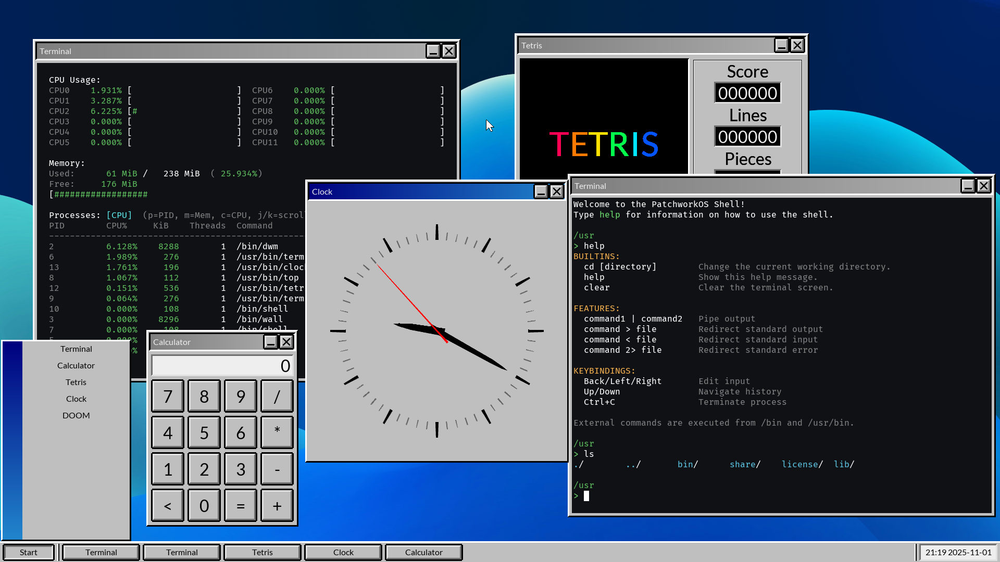

# PatchworkOS

> **⚠ Warning**<br> Keep in mind that PatchworkOS is currently in a very early stage of development, and may have both known and unknown bugs.

 [](https://github.com/KaiNorberg/PatchworkOS/actions/workflows/test.yml)

**Patchwork** is a 64 bit monolithic hobbyist OS built from scratch in C for the x86_64 architecture. It's intended as an easy-to-modify toy-like NON-POSIX OS that takes many ideas from Unix, Plan9, DOS and other places while simplifying them and removing some fat. Made entirely for fun.

## Screenshots




## Quick Start

```bash
git clone --recursive https://github.com/KaiNorberg/PatchworkOS
cd PatchworkOS
make all
make run  # Requires QEMU
```

See [Setup](#Setup) for more.

## Features

- Kernel level multithreading with a [constant-time scheduler](https://github.com/KaiNorberg/PatchworkOS/blob/main/src/kernel/sched/sched.h).
- Fully preemptive and tickless kernel.
- Symmetric Multi Processing (SMP).
- Kernel memory management is designed for constant-time operations per page, including both the physical and virtual memory managers.
- Custom C standard library and system libraries.
- SIMD.
- [Custom image format (.fbmp)](https://github.com/KaiNorberg/fbmp).
- [Custom font format (.grf)](https://github.com/KaiNorberg/grf).
- Strict adherence to "everything is a file".
- IPC including pipes, shared memory, sockets and Plan9 inspired "signals" called notes.
- And much more...

## Notable Differences with Unix

- Multiroot file system, with labels not letters ```/usr/bin```.
- Replaced ```fork(), exec()``` with ```spawn()```.
- Single-User.
- Non POSIX standard library.

## Limitations

- Currently limited to RAM disks only.
- Only support for x86_64.

## Notable Short Term Future Plans

- Software interrupts for notes (signals).
- Lua port.
- Capability based security model (currently has no well-defined security model).

## A Small Taste

Patchwork strictly follows the "everything is a file" philosophy in a way similar to Plan9, this can often result in unorthodox APIs or could just straight up seem overly complicated, but it has its advantages. I will give some examples and then after I will explain why this is not a complete waste of time. Let's start with sockets.

### Sockets

In order to create a local socket, you open the ```sys:/net/local/new``` file, which will return a file that acts as the handle for your socket. Reading from this file will return the ID of your created socket so, for example, you can do

```c
    fd_t handle = open("sys:/net/local/new");
    char id[32];
    read(handle, id, 32);
```

Note that when the handle is closed, the socket is also freed. The ID that the handle returns is the name of a directory that has been created in the "sys:/net/local" directory, in which there are three files, these include:

- ```data``` - used to send and retrieve data.
- ```ctl``` - used to send commands.
- ```accept``` - used to accept incoming connections.

So, for example, the sockets data file is located at ```sys:/net/local/[id]/data```. Note that only the process that created the socket or its children can open these files. Now say we want to make our socket into a server, we would then use the bind and listen commands, for example

```c
    fd_t ctl = openf("sys:/net/local/%s/ctl", id);
    writef(ctl, "bind myserver");
    writef(ctl, "listen");
    close(ctl);
```

Note the use of openf() which allows us to open files via a formatted path and that we name our server myserver. If we wanted to accept a connection using our newly created server, we just open its accept file, like this

```c
    fd_t fd = openf("sys:/net/local/%s/accept", id);
```

The returned file descriptor can be used to send and receive data, just like when calling accept() in for example Linux or other POSIX operating systems. This is practically true of the entire socket API, apart from using these weird files everything (should) work as expected. For the sake of completeness, if we wanted to connect to this server, we can do something like this

```c
    fd_t handle = open("sys:/net/local/new");
    char id[32];
    read(handle, id, 32);

    fd_t ctl = openf("sys:/net/local/%s/ctl", id);
    writef(ctl, "connect myserver");
    close(ctl);
```

### File Flags?

You may have noticed that, in the above section, the open() function does not take in a flags argument or anything similar. This is because flags are part of the file path directly so if you wanted to create a non-blocking socket, you would use

```c
    fd_t handle = open("sys:/net/local/new?nonblock");
```

Multiple flags can be separated with the ```&``` character, like an internet link. However, there are no read and/or write flags, all files are both read and write.

### The Why

So, finally, I can explain why I've decided to do this. It does seem overly complicated at first glance. There are three reasons in total.

The first is that I want Patchwork to be easy to expand upon, for that sake I want its interfaces to be highly generalized. Normally, to just implement a single system call is quite a lot of work. You'd need to implement its behavior, register the system call handler, then you'd need to create it in the standard library, and you'd need to make whatever software to actually use that system call, that is a surprisingly large amount of stuff that needs to be changed just for a single small system call. Meanwhile with this system, when sockets were implemented the only thing that needed to be done was implementing the sockets, the rest of the operating system could remain the same.

The second reason is that it makes using the shell far more interesting, there is no need for special functions or any other magic keywords to for instance use sockets, all it takes is opening and reading from files.

Let's take an example of these first two reasons. Say we wanted to implement the ability to wait for a process to die via a normal system. First we need to implement the kernel behavior to do that, then the appropriate system call, then add in handling for that system call in the standard library, then the actual function itself in the standard library and finally probably create some program that could be used in the shell. That's a lot of work for something as simple as a waiting for a process to die. Meanwhile, if waiting for a processes death is done via just writing to that processes "ctl" file then it's as simple as adding a "wait" action to it and calling it a day, you can now easily use that behavior via the standard library and via the shell by something like ```echo wait > sys:/proc/[pid]/ctl``` without any additional work.

And of course the third and final reason is because I think it's fun, and honestly I think this kind of system is just kinda beautiful due to just how generalized and how strictly it follows the idea that "everything is a file". There are downsides, of course, like the fact that these systems are less self documenting. But that is an argument for another time.

## A Big Taste (Documentation)

If you are still interested in knowing more, then you can check out the Doxygen generated [documentation](https://kainorberg.github.io/PatchworkOS/html/index.html).

## Directories

| Directory | Description |
| :-------- | :---------- |
| [include](https://github.com/KaiNorberg/PatchworkOS/tree/main/include) | Public API |
| [src](https://github.com/KaiNorberg/PatchworkOS/tree/main/src) | Source code |
| [root](https://github.com/KaiNorberg/PatchworkOS/tree/main/root) | Files copied to the root directory of the generated .iso |
| [tools](https://github.com/KaiNorberg/PatchworkOS/tree/main/tools) | Build scripts (hacky alternative to cross-compiler) |
| [make](https://github.com/KaiNorberg/PatchworkOS/tree/main/make) | Make files |
| [lib](https://github.com/KaiNorberg/PatchworkOS/tree/main/lib) | Third party dependencies |
| [meta](https://github.com/KaiNorberg/PatchworkOS/tree/main/meta) | Screenshots and repo metadata |

### Sections

- **boot**: Minimal UEFI bootloader that collects system info and loads the kernel
- **kernel**: The monolithic kernel handling everything from scheduling to IPC
- **libstd**: C standard library extension with system call wrappers
- **libpatchwork**: Higher-level library for windowing and user space services
- **programs**: Shell utilities, services, and desktop applications

## Setup

### Requirements

- **OS:** Linux, WSL appears to work, but I make no guarantees
- **Tools:** GCC, make, NASM, mtools, QEMU (optional)

### Build and Run

```bash
# Clone this repository, you can also use the green Code button at the top of the Github.
git clone --recursive https://github.com/KaiNorberg/PatchworkOS
cd PatchworkOS

# Build (creates PatchworkOS.img in bin/)
make all

# Run using QEMU
make run
```

### Alternative Runtimes

- **Real Hardware:** Flash `PatchworkOS.img` to USB with tools like [balenaEtcher](https://etcher.balena.io/)
- **Other VMs:** Import the `.img` file into VirtualBox, VMware, etc.

### Troubleshooting

- **QEMU boot failure** Avoid QEMU 10.0.0 try using version 9.2.3.
- **Build fails?** Ensure all dependencies are installed.
- **Any other errors?** If an error not listed here occurs or is not resolvable, please open an issue in the GitHub.

## Testing

This repository uses a bit of a hacky way to do testing, we use a github action, as normal, that compiles the operating system then runs it using QEMU. QEMU is then allowed to run for one minute, the kernel will run some tests and then start as normal. If QEMU crashes* then the test fails, if it is still running after one-minute we call it a success. Its an overly simple approach but gets the job done. A lot of the difficulty in performing testing comes from the inherent complexity of testing a OS, which also means that testing is currently very very limited in the kernel.

\* QEMU will crash if a kernel panic occurs due to the use of QEMU's isa-debug-exit in the kernel when make is called with DEBUG=1.

### Tested Configurations

- QEMU emulator version 9.2.3 (qemu-9.2.3-1.fc42)
- Lenovo ThinkPad E495
- Ryzen 5 3600X | 32GB 3200MHZ Corsair Vengeance

Currently untested on Intel hardware. Let me know if you have different hardware, and it runs (or doesn't) for you!

## Contributing

If you find any bugs, issues or just have a suggestion for something I could do better, then feel free to open an issue or if you feel like it, you may submit a pull request!
